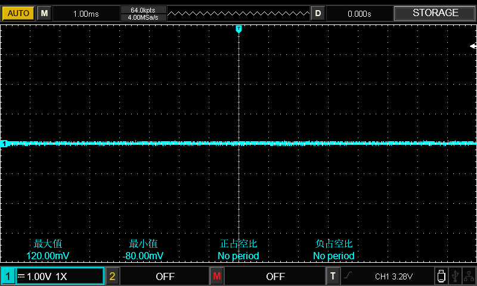

# 示波器使用  
[官方说明文档](https://instruments.uni-trend.com.cn/static/upload/file/20211012/UTD2000CEX+%E7%B3%BB%E5%88%97%E4%BD%BF%E7%94%A8%E6%89%8B%E5%86%8C%20REV.3.pdf)  

[b站示波器视频](https://www.bilibili.com/video/BV1K44y147LK?spm_id_from=333.337.search-card.all.click)  

[说明书离线文件](../../res/files/UTD2000CEX+系列使用手册REV.3.pdf)  

## GPIO [General-purpose input/output]  
通用型之输入输出的简称，功能类似8051的P0—P3，其引脚可以供使用者由程控自由使用，PIN脚可作为通用输入（GPI）或通用输出（GPO）或通用输入与输出（GPIO），如当clk generator, chip select等。  

既然一个引脚可以用于输入、输出或其他特殊功能，那么一定有暂存器用来选择这些功能。对于输入，一定可以透过读取某个暂存器来确定引脚电位的高低；对于输出，一定可以透过写入某个暂存器来让这个引脚输出高电位或者低电位；对于其他特殊功能，则有另外的暂存器来控制它们。  

## 测量高低电平  
数字电路
对于数字电路而言，什么是高电平呢？在数字电路中，把电压的高低用逻辑电平来表示。其中逻辑电平就分为高电平和低电平这两种。这两种电平在电路中的体现为“有”或者“无”，无中间值，与其在不同电路上的电压值不同。  

在电子和自动化控制中，分为模拟信号和数字信号，在数字逻辑电子电路中，数字信号是二进制的，即只有0信号和1信号。  

- 高电平表示电压高的状态,记为1，一般规定高电平为3.5~5V。  
- 低电平表示电压低的状态, 记为0，一般规定低电平为0~0.25V。   

不定电压：对于高低电平之间的电压属于不定电压，在这个电压下会使器件工作不稳定，比如有时电脑开机后有不正常现象,但重新启动后又没问题了，就是因为数字电路有时因为器件遇到了这个不定电压而无法识别发生紊乱。  

假设有一个5V供电的数字电路，对于该电路而言，那么在5V左右的电压值就为高电平，而在0V左右的就是低电平。

低电平: 120mv 
 

    

  

> 使用只能万用表测试低电平电压，无法测量，使用老是万用表，会显示 0V   

高电平: 3.3V 
 

    

  

## 树莓派PWM  

正占空比 10%
 

    

  

正占空比 统计异常 
 

    

  

正占空比 15%
 

    

  

## 通过斜率触发  

 

    

  

> 注意触发方式， `正常` 无触发信号时停止数据采集，当有触发信号产生时，则产生触发扫描。  `单次`每当有触发信号输入时，产生一次触发，然后停止。  

 

    

  

 

    

  

