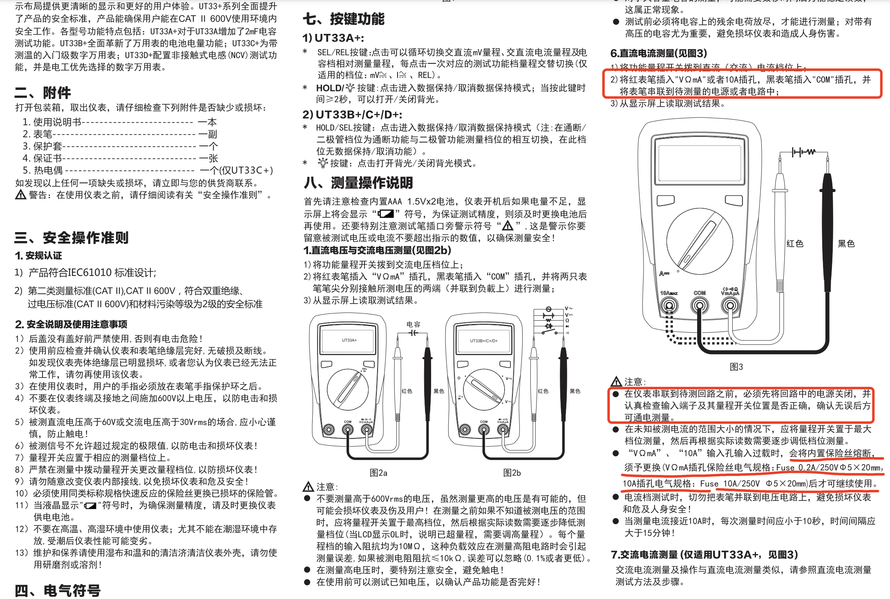

# 电子仪器的使用  

## 万用表
[优利德UT33+使用说明书](https://meters.uni-trend.com.cn/static/upload/file/20211030/UT33+%E7%B3%BB%E5%88%97%E4%B8%AD%E6%96%87%E8%AF%B4%E6%98%8E%E4%B9%A6.pdf)  
[优利德UT33+使用说明书-离线版](../../res/files/UT33+系列中文说明书.pdf)  

接线及电流的测量: 

 

    

  

> 电流一定要串联在电路中，并联会烧毁保险丝，需要更换。

