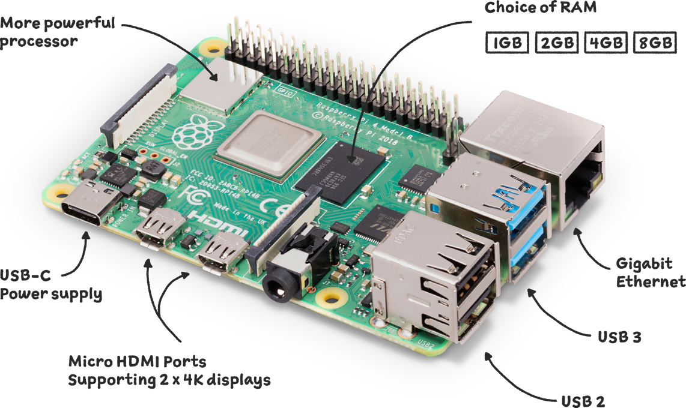
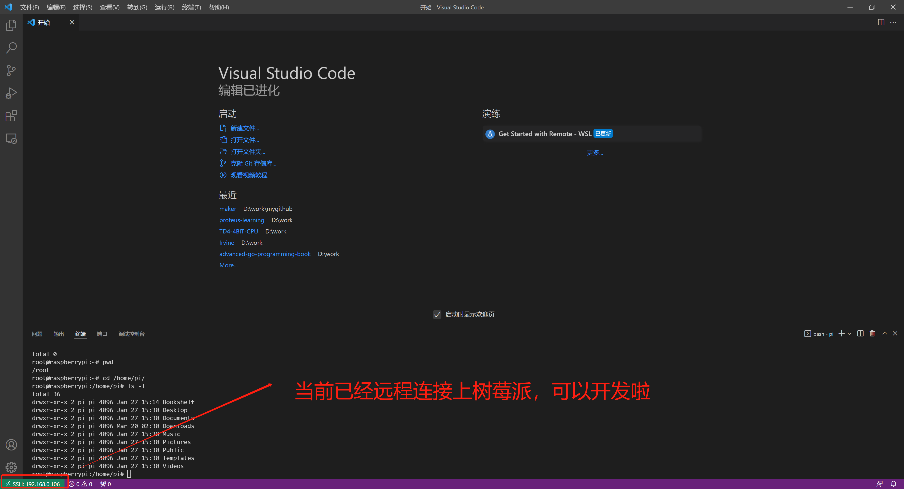
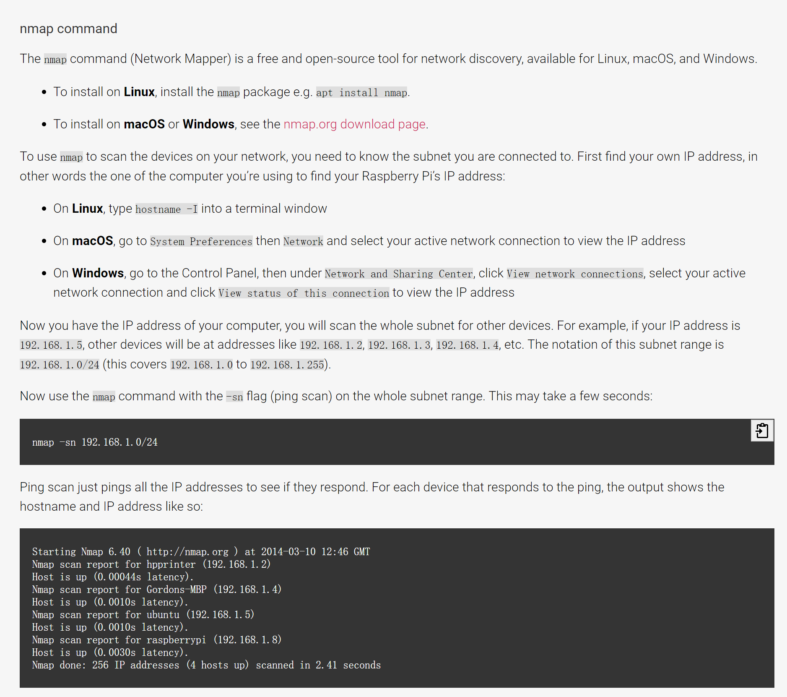
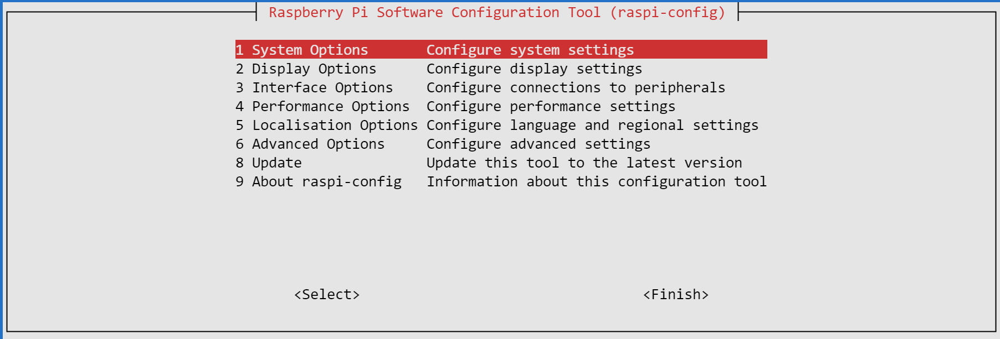
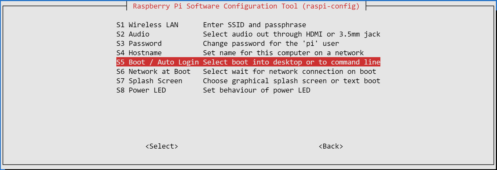
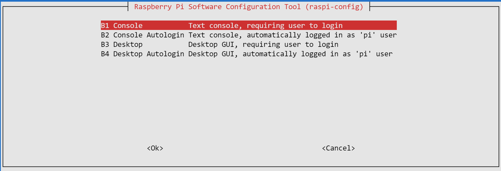

# 树莓派Pico与4B 
## Pico 
### 开发与调试  
[官方说明](https://www.raspberrypi.com/products/raspberry-pi-pico/) ,[离线文件](../../res/files/getting-started-with-pico.pdf)    

[快速开始](https://datasheets.raspberrypi.com/pico/getting-started-with-pico.pdf)  
[C/C++ SDK](https://datasheets.raspberrypi.com/pico/raspberry-pi-pico-c-sdk.pdf)  
[Python SDK](https://datasheets.raspberrypi.com/pico/raspberry-pi-pico-python-sdk.pdf)  

- #### 搭建开发环境  
开发环境搭建:  
```shell
$ wget https://raw.githubusercontent.com/raspberrypi/pico-setup/master/pico_setup.sh
$ chmod +x pico_setup.sh
$ ./pico_setup.sh
# sudo reboot
```

可以使用vscode调式，需要的插件有:  
```shell
# Get extensions
code --install-extension marus25.cortex-debug
code --install-extension ms-vscode.cmake-tools
code --install-extension ms-vscode.cpptools
```

脚本作用:  
```
• Create a directory called pico
• Install required dependencies
• Download the pico-sdk, pico-examples, pico-extras, and pico-playground repositories
• Define PICO_SDK_PATH, PICO_EXAMPLES_PATH, PICO_EXTRAS_PATH, and PICO_PLAYGROUND_PATH in your ~/.bashrc
• Build the blink and hello_world examples in pico-examples/build/blink and pico-examples/build/hello_world
• Download and build picotool (see Appendix B), and copy it to /usr/local/bin.
• Download and build picoprobe (see Appendix A).
• Download and compile OpenOCD (for debug support)
• Download and install Visual Studio Code
• Install the required Visual Studio Code extensions (see Chapter 7 for more details)
• Configure the Raspberry Pi UART for use with Raspberry Pi Pico
```  

> 更新问题1: code:armhf : Depends: libnss3:armhf (>= 2:3.26) but it is not installable
```
$ sudo apt-get install -f  
```


- #### 下载SDK  
  
```shell
# 先创建一个目录
$ cd ~/
$ mkdir pico
$ cd pico

# 下载代码
$ git clone -b master https://github.com/raspberrypi/pico-sdk.git
$ cd pico-sdk
$ git submodule update --init
$ cd ..
$ git clone -b master https://github.com/raspberrypi/pico-examples.git

# 安装依赖
$ sudo apt update
$ sudo apt install cmake gcc-arm-none-eabi libnewlib-arm-none-eabi build-essential

# 更新SDK. 首次不用更新
$ cd pico-sdk
$ git pull
$ git submodule update

```

- #### 闪烁LED
[代码](https://github.com/raspberrypi/pico-examples/blob/master/blink/blink.c#L9-L23)  

```c
/**
 * Copyright (c) 2020 Raspberry Pi (Trading) Ltd.
 *
 * SPDX-License-Identifier: BSD-3-Clause
 */

#include "pico/stdlib.h"

int main() {
#ifndef PICO_DEFAULT_LED_PIN
#warning blink example requires a board with a regular LED
#else
    const uint LED_PIN = PICO_DEFAULT_LED_PIN;
    gpio_init(LED_PIN);
    gpio_set_dir(LED_PIN, GPIO_OUT);
    while (true) {
        gpio_put(LED_PIN, 1);
        sleep_ms(250);
        gpio_put(LED_PIN, 0);
        sleep_ms(250);
    }
#endif
}
```

编译: 
```
$ cd pico-examples
$ mkdir build
$ cd build

$ export PICO_SDK_PATH=../../pico-sdk
$ cmake ..
```

编译结果:
```
-- Configuring done
-- Generating done
-- Build files have been written to: /home/matrix/pico/pico-examples/build
```

烧录:
通过日志查看设备:  
```shell
matrix@ubuntu:~$ sudo dmesg | tail
[ 4193.744136] blk_update_request: I/O error, dev fd0, sector 0 op 0x0:(READ) flags 0x0 phys_seg 1 prio class 0
[ 4193.744143] floppy: error 10 while reading block 0
[ 4193.780276] blk_update_request: I/O error, dev fd0, sector 0 op 0x0:(READ) flags 0x0 phys_seg 1 prio class 0
[ 4193.780284] floppy: error 10 while reading block 0
[ 4256.137566] usb 1-1: new high-speed USB device number 3 using ehci-pci
[ 4256.404587] usb 1-1: New USB device found, idVendor=0451, idProduct=82ee, bcdDevice= 1.10
[ 4256.404591] usb 1-1: New USB device strings: Mfr=0, Product=0, SerialNumber=0
```


- #### HelloWorld   
按住`BOOTSEL`按键，切换到`USB Mass Storage Mode`模式。  


## 4B 
- ### [官方文档](https://www.raspberrypi.com/documentation/computers/getting-started.html#setting-up-your-raspberry-pi)  

### 环境搭建

<br>
<div align=center>
    
</div>


- ### 系统下载及安装  
[官方下载地址](https://www.raspberrypi.com/software/)   

需要安装`SSH`服务，并在设置中开启。 另外需要设置`静态IP`，并安装`VNC` 

```
vim /etc/dhcpcd.conf

#设置无线静态IP
interface wlan0
#IP地址 
static ip_address=192.168.0.106/24
#网关 
static routers=192.168.0.1
#DNS 
static domain_name_servers=114.114.114.114
```

> VNC需要通过IP连接后，增加别名。  

### 开发环境搭建  

开启`root`远程登陆  `sudo vim /etc/ssh/sshd_config`  
```
PermitRootLogin yes
```

重启ssh服务: `service sshd restart`

在win或macos下载vscode，安装`Remote - SSH`插件，配置树莓派链接  
```shell
Host 192.168.0.106  # 树莓派IP 
HostName 192.168.0.106 # 树莓派IP 
User root
```  

<br>
<div align=center>
    
</div>


> nmap查找树莓派ip地址  

<br>
<div align=center>
    
</div>

### 命令行模式与GUI模式切换  
可以通过`sudo raspi-config`选择启动方式  

<br>
<div align=center>
    
</div>

<br>
<div align=center>
    
</div>

<br>
<div align=center>
    
</div>


后台执行的操作  
```
root@raspberrypi:/home/pi#  sudo raspi-config
Removed /etc/systemd/system/default.target.
Created symlink /etc/systemd/system/default.target → /lib/systemd/system/multi-user.target
```

> 已命令行的方式启动，内存瞬间多了1G，目前剩余3.4G  

