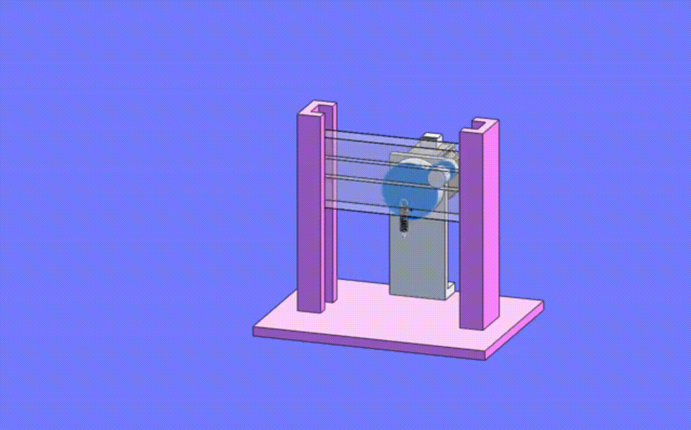

# 机械运动基础  
[通过机械动画学机械运动](http://www.3dwhere.com/movieslist)   

## 直线运动 

 

    

    转动齿轮带动齿条运动 

 

    

    连续旋转变往复直线运动 

 

    

    单向离合器实现的直进运动机构 

 

    

    齿轮齿条联动的等速快速往返机构 

 

    

    通过支杆与曲柄实现的直线运动机构 

 

    

    马达旋转连接杠杆的长行程往返机构 

## 机械夹子  

 

    

    机械手夹持器 

## 电动转盘  

