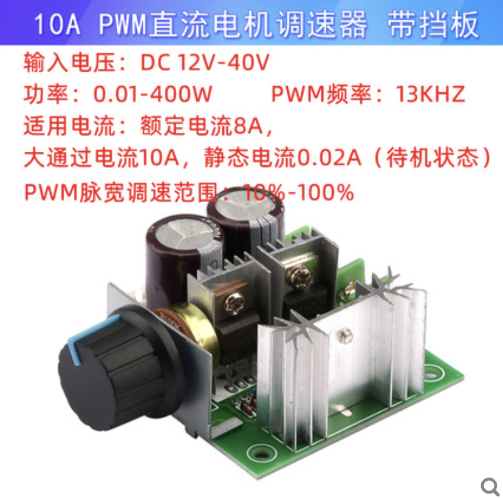
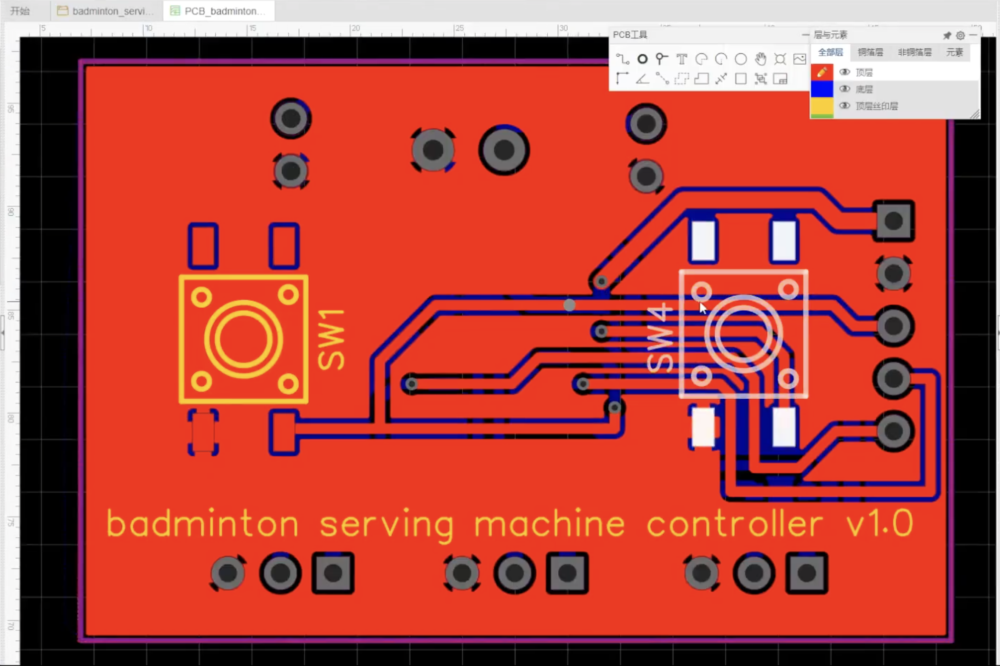
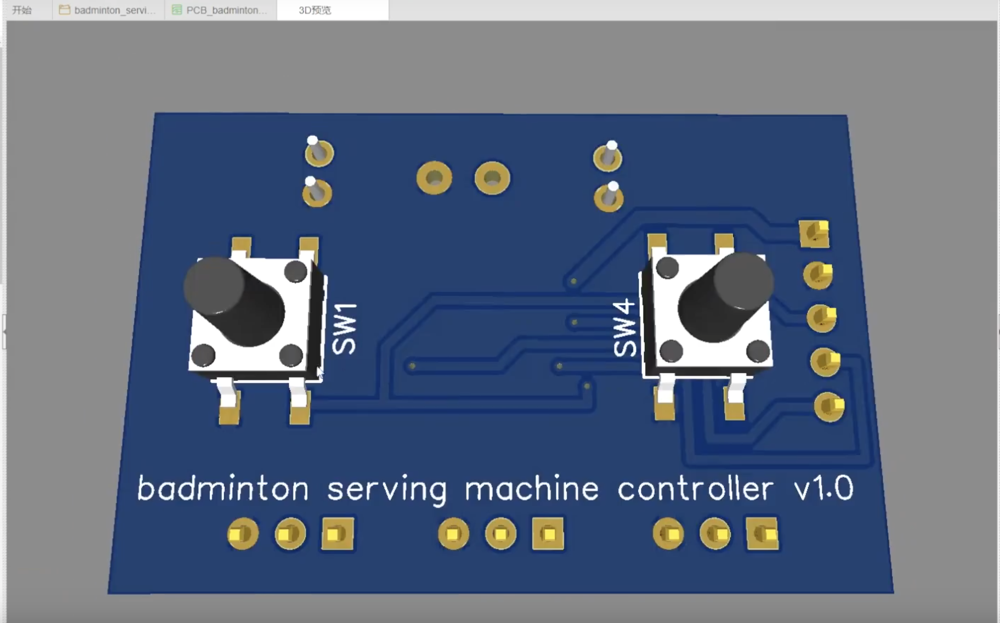
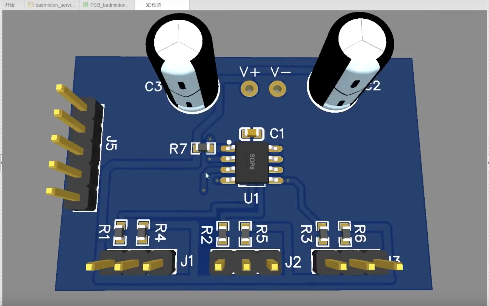
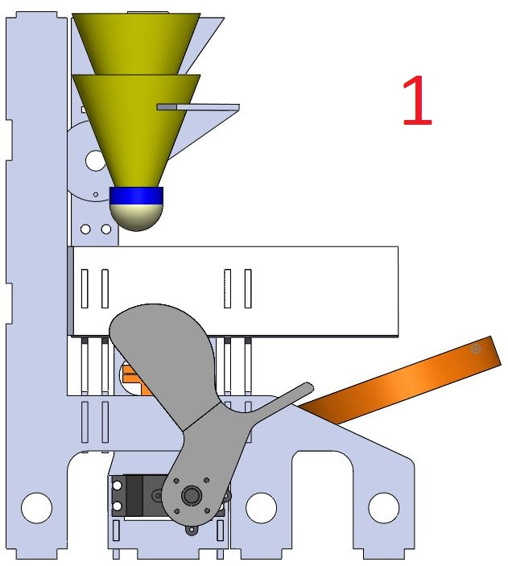
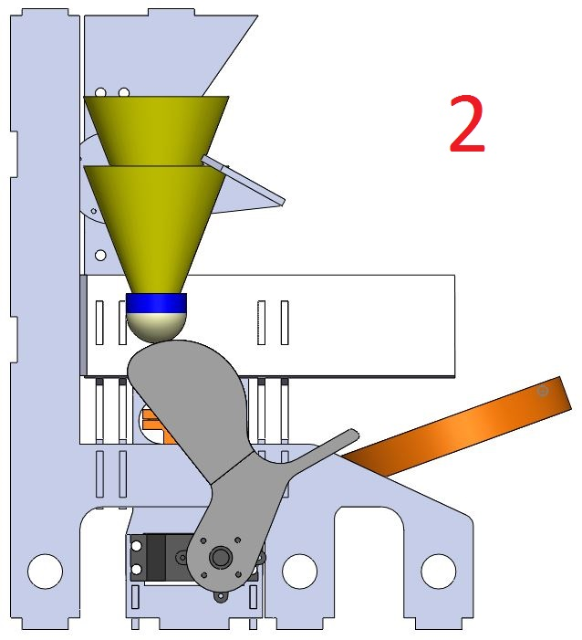
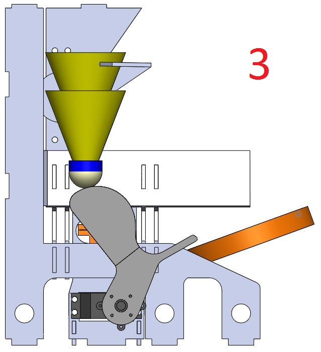
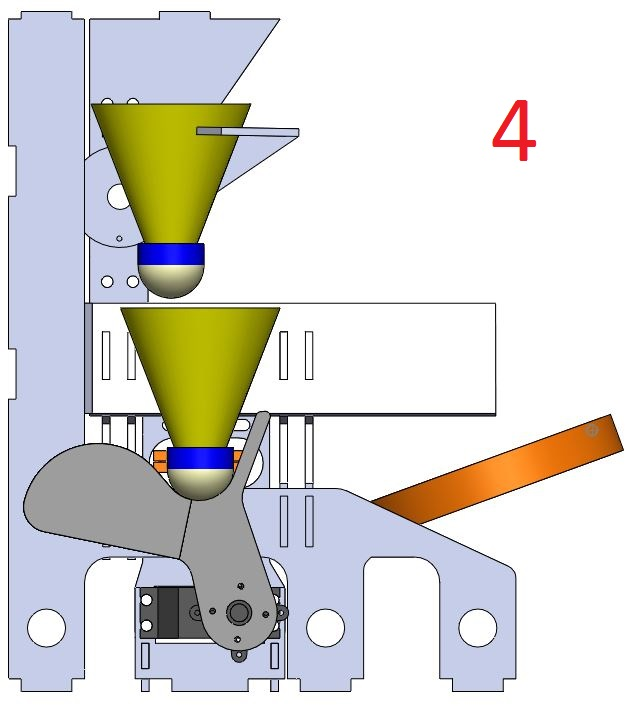
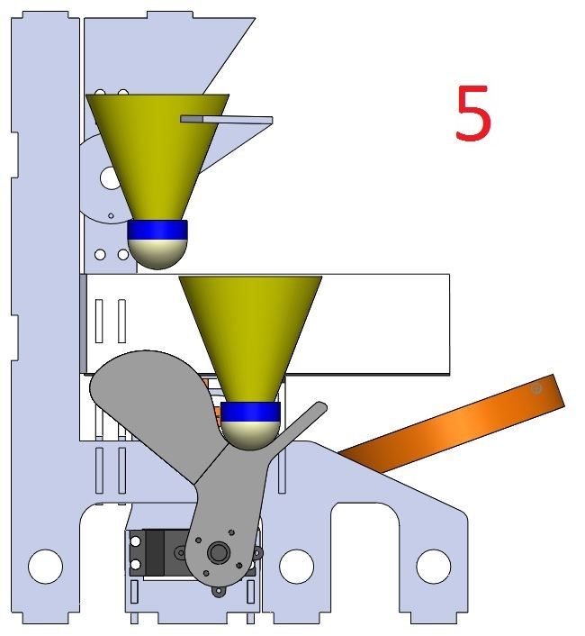

# 羽毛球发球机
# DIY 羽毛球发球机  
- ## 介绍
### [主要参考资料](http://www.3dwhere.com/models/m2rt2oda8jibc93z) >> [资源文件](res\files\羽毛球机-原始文件.zip)    
[参考资料](../../res/files/Shuttlecock-project-documentation.pdf)  
[视频参考](https://www.bilibili.com/video/BV1kq4y1w7kp?spm_id_from=333.999.0.0)  

项目为能够一个接一个地发射多个羽毛球的羽毛球发射机。一方面是因为市场上羽毛球机比较贵，另外是自制可以自己实际需要制作，减少额外支出!  

该机器首先使用基于浏览器的在线 CAD 程序 [Onshape](https://www.onshape.com/en/) 进行建模。设计完成后，订购了所需的零件，并开始制造其他零件。
该机器使用了许多商业零件，以及手工和增材制造的零件。该机由发射组件和装载组件两个模块组成，可以并行设计和组装。
组装完成后，进行了一些测试以调整发射轮的旋转。  

该机器具有两个功能: 羽毛球的装载和发球。
从插入机器顶部的羽毛球管中抓取羽毛球，羽毛球被机械手臂抓住后，手臂向下移动，羽毛球落到滑道上。滑块在旋转的轮子之间带动羽毛球，羽毛球在轮子间被射出。

- ## 设计

  - ### 元器件  

    - 2 `24V DC 电机`   
    目前使用的是775电机。775电机，高转速，大扭力，适合DIY各种电动工具，适合制作大扭力装置的模型。12V-24V均可以使用。建议使用5A以上电源适配器进行供电，理想供电电流为8A。  
    虽然795电机的扭矩更大，但是对电源的要求也会更高。895就更是了。  
    [有刷与无刷电机的区别](https://zhuanlan.zhihu.com/p/71615249)  
    直流有刷电机通过电压的调节，就可以调节电机的转速，进而控制发球的速度。  
    - 2 `编码器计米轮`  
      周长300mm 孔直径6mm 
    - 3 `舵机`    
    两个360度，一个180度  
    - 1 `PWM直流电机调速器`  
    Pulse WidthModulator、简称PWM，直流电机调速器就是调节直流电动机速度的设备。  
     
    

        
    

     
    > 加入输入为DC9-60V，输出的电流如何变化呢？   

  - ### 控制板
  立创EDA  
    

        
    

     
    

        
    

     
    

        
    

       

   - ### 尺寸  
   长宽高为: 260 X 260 x 280 mm  厚度为5mm
   

  - ### solidworks 模型设计
  - ### 装载和发球过程  
    
    

        
    

    
    

        
    

    
    

        
    

    
    

        
    

   
    

        
    
   
- ## 制造和组装

- ## 软件设计
  - ### [树莓派驱动舵机](raspi-rc.md)  

- ## 成果展示  

