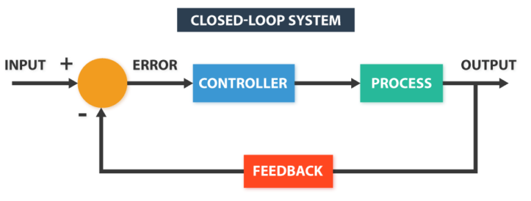
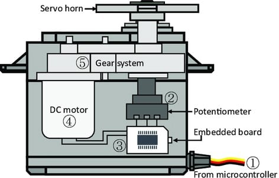
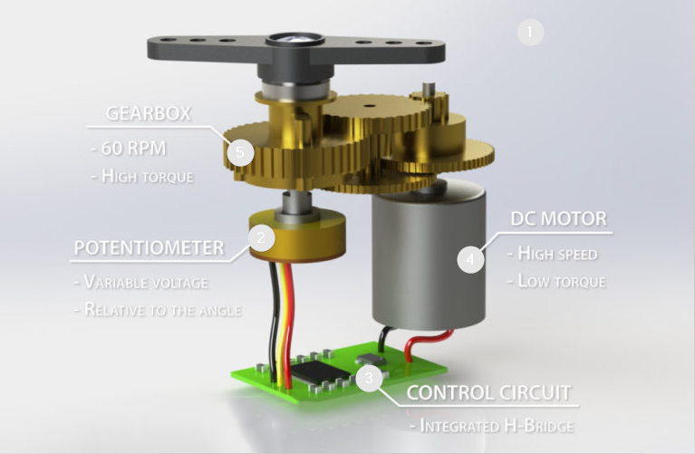
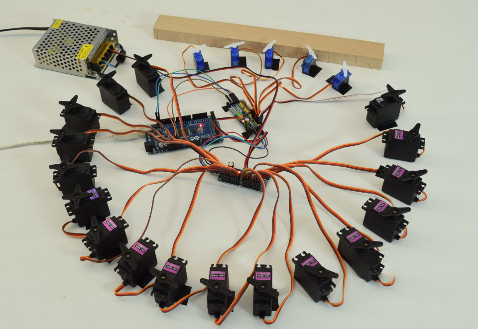
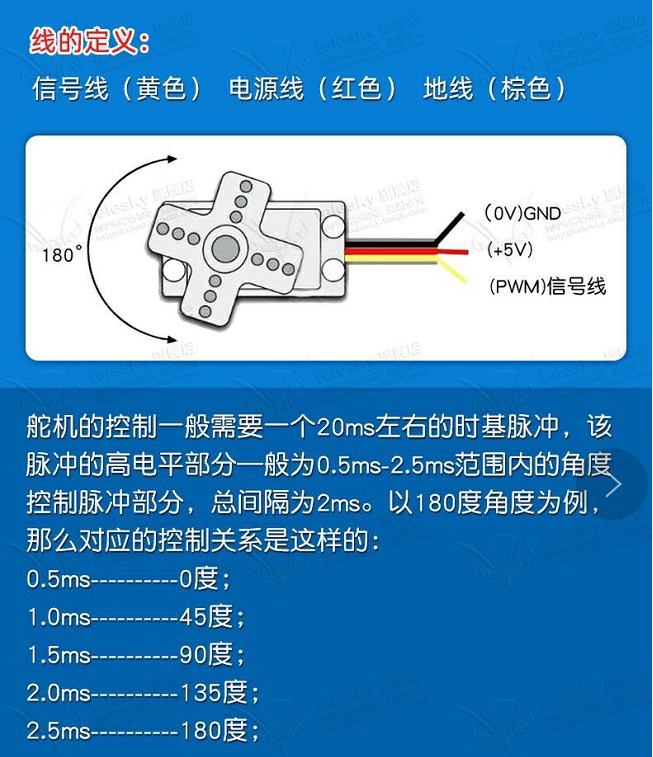
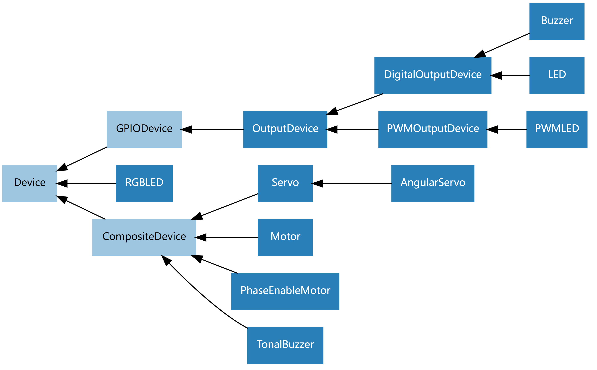
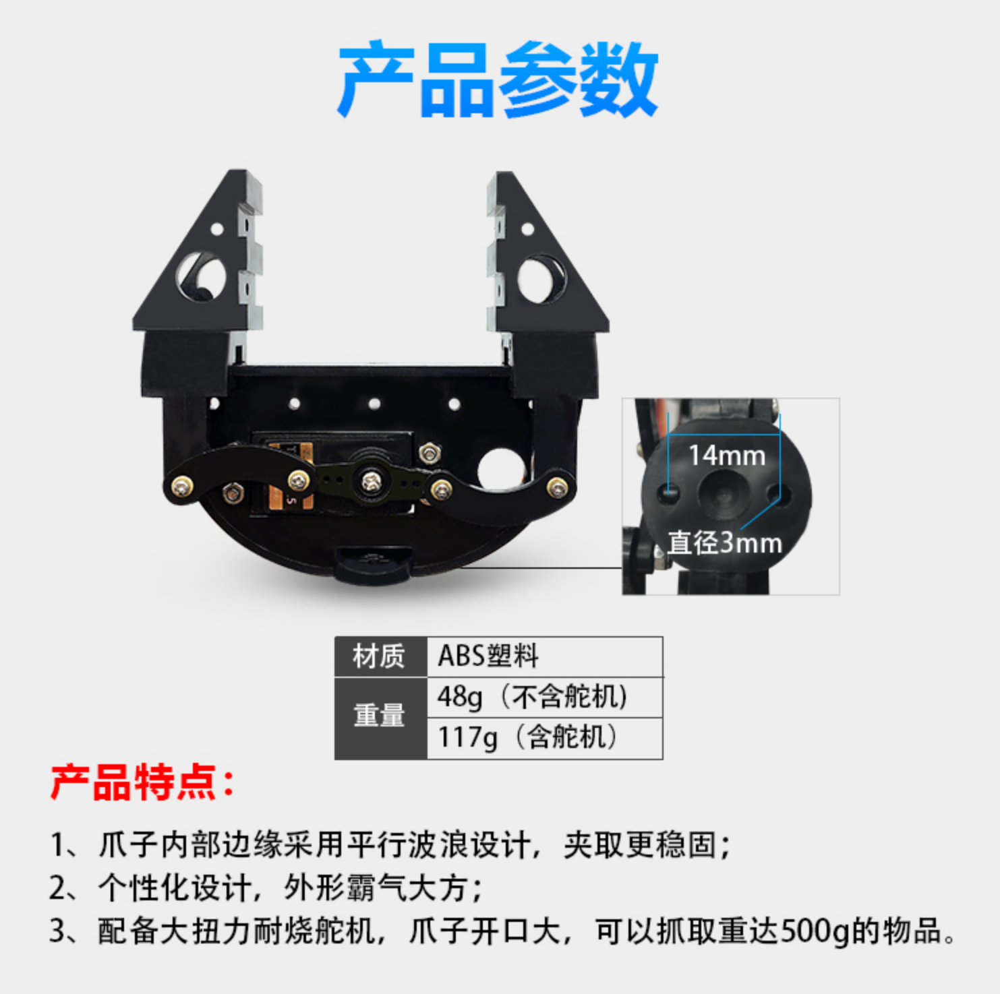

# 树莓派驱动舵机 

## [raspi基础知识](../../md/electronic/respi.md)  

## 舵机知识  
`舵机`是`伺服电机`的一种，伺服电机就是带有`反馈环节`的电机，我们可以通过伺服电机进行精确的位置控制或者输出较高的扭矩；  
类似舵机这样的伺服系统通常由小型电动机，电位计，嵌入式控制系统和变速箱组成。  
电机输出轴的位置由内部电位计不断采样测量，并与微控制器（例如STM32,Arduino）设置的目标位置进行比较；  
根据相应的偏差，控制设备会调整电机输出轴的实际位置，使其与目标位置匹配。这样就形成了闭环控制系统。  

<br>
<div align=center>
    
</div>


<br>
<div align=center>
    
</div>

变速箱降低了电机的转速，从而增加了输出轴上的输出扭矩。输出轴的最大速度通常约为60 RPM。

具体结构如下图所示；

- ①：信号线：接收来自微控制器的控制信号；
- ②：电位器：可以测量输出轴的位置量，属于整个伺服机构的反馈部分；
- ③：内部控制器：处理来自外部控制的信号，驱动电机以及处理反馈的位置信号，是整个伺服机构的核心；
- ④：电机：作为执行机构，输出多少转速，转矩，位置；
- ⑤：传动机构/舵机系统：该机构根据一定传动比，将电机输出的行程缩放到最终输出的角度上；


<br>
<div align=center>
    
</div>


舵机的硬件布线比较简单，我们只需要三条线：电源线，信号线，地线；

如果单个舵机的电流比较小，例如SG90这种舵机，在空闲的时候大约只消耗10mA的电流，在旋转的时候需要消耗100-250mA，因此，一般控制系统如果具备这样的输出能力，可以直接进行驱动；

如果舵机所需电流较大，则需要额外增加驱动电路，将数字控制端和功率端隔离开；

或者需要同时驱动多个舵机，可以使用PCA9685对多路PWM进行驱动； 

<br>
<div align=center>
    
</div>

- #### 控制原理-脉冲  

<br>
<div align=center>
    
</div>

伺服控制是一种通过向伺服发送 PWM（脉冲宽度调制）信号来控制多种类型的RC/爱好者伺服的方法，这是一系列可变宽度的重复脉冲，其中 `脉冲宽度`（最常见的现代业余伺服）或 `脉冲序列的占空比`（今天不太常见）决定了伺服要达到的位置。PWM 信号可能来自无线电控制接收器到伺服系统或来自常见的微控制器，例如Arduino。

小型业余舵机（通常称为无线电控制或 RC 舵机）通过标准的三线连接进行连接：两根线用于直流电源，一根用于控制，`携带控制脉冲`。

脉冲的参数是`最小脉冲宽度`、`最大脉冲宽度`和`重复率`。给定伺服的旋转约束，将中性定义为旋转中心。不同的舵机对其旋转有不同的限制，但中性位置始终为 1.5 毫秒 (ms) 左右的脉冲宽度。  


说到舵机的控制信号，一般是脉宽调制（PWM）信号，如下图，直观反映了PWM信号和舵机转动角度的关系，
你也可以简单的理解为，通过给舵机通电的时间控制，结合角度传感器的反馈信号检测和控制，实现了舵机的精确角度控制。  

<br>
<div align=center>
    
</div>

控制线用于传输角度控制信号。这个角度是由控制信号脉冲的持续时间决定的，这叫做脉冲编码调制（PCM）。
舵机的控制一般需要一个20ms左右的时基脉冲，该脉冲的高电平部分一般为0.5ms-2.5ms范围，总间隔为2ms。脉冲的宽度将决定马达转动的距离。
例如：1.5毫秒的脉冲，电机将转向90度的位置（通常称为中立位置，对于180°舵机来说，就是90°位置）。
如果脉冲宽度小于1.5毫秒，那么电机轴向朝向0度方向。
如果脉冲宽度大于1.5毫秒，轴向就朝向180度方向。以180度舵机为例，对应的控制关系是这样的：  

```
0.5ms————-0度；
1.0ms————45度；
1.5ms————90度；
2.0ms———–135度；
2.5ms———–180度；
```

## 树莓派控制舵机 
`servo ['sɜːvəʊ]  n. 伺服系统；伺服电动机 `  

- ### Pin脚及权限  
[树莓派Pin脚作用](https://www.raspberrypi.com/documentation/computers/os.html#gpio-and-the-40-pin-header) 

输入`pinout`命令  
```
J8:
   3V3  (1) (2)  5V    
 GPIO2  (3) (4)  5V    
 GPIO3  (5) (6)  GND   
 GPIO4  (7) (8)  GPIO14
   GND  (9) (10) GPIO15
GPIO17 (11) (12) GPIO18
GPIO27 (13) (14) GND   
GPIO22 (15) (16) GPIO23
   3V3 (17) (18) GPIO24
GPIO10 (19) (20) GND   
 GPIO9 (21) (22) GPIO25
GPIO11 (23) (24) GPIO8 
   GND (25) (26) GPIO7 
 GPIO0 (27) (28) GPIO1 
 GPIO5 (29) (30) GND   
 GPIO6 (31) (32) GPIO12
GPIO13 (33) (34) GND   
GPIO19 (35) (36) GPIO16
GPIO26 (37) (38) GPIO20
   GND (39) (40) GPIO21
```

<br>
<div align=center>
    
</div>

> 如果新建用户没有权限，可通过 `sudo usermod -a -G gpio <username>` 增加  


> 树莓派具有`PWM` 、`SPI` 、`I2C` 、`Serial` 功能  

- PWM（脉宽调制）
  - 软件 PWM 在所有引脚上可用
  - GPIO12、GPIO13、GPIO18、GPIO19 上提供硬件 PWM

- SPI
  - SPI0：MOSI（GPIO10）；MISO  (GPIO9); SCLK（GPIO11）；CE0 (GPIO8), CE1 (GPIO7)
  - SPI1：MOSI（GPIO20）；MISO  (GPIO19); SCLK（GPIO21）；CE0（GPIO18）；CE1（GPIO17）；CE2 (GPIO16)

- I2C
  - 数据：（GPIO2）；时钟 (GPIO3)
  - EEPROM数据：（GPIO0）；EEPROM 时钟 (GPIO1)

- 串口
  - TX（GPIO14）；RX（GPIO15）

- ### 接线及GPIO 控制  

接线: 
   3V3  (1) (2)  5V    
 GPIO2  (3) **(4)  5V**   
 GPIO3  (5) **(6)  GND**   
 GPIO4  (7) **(8)  GPIO14**  

 4、6、8 三个引脚，8引脚为GPIO14  

> 舵机的正负极不能接反了，要不然烧坏了。  

<br>
<div align=center>
    
</div>

使用 [GPIO Zero](https://gpiozero.readthedocs.io/en/stable/#)  库可以轻松开始使用 Python 控制 GPIO 设备。该库在 [gpiozero.readthedocs.io](https://github.com/raspberrypi/documentation/blob/develop/documentation/asciidoc/computers/os/using-python.adoc) 上进行了全面记录。

```shell
sudo pip3 install gpiozero
```

> 官方OS已经内置了，直接使用即可。vscode 需要安装python插件 


```python
from gpiozero import Servo
from time import sleep
 
myGPIO = 14
myCorrection = 0
# 脉冲最大值 2ms 最小值1ms 中间位置为1.5ms 
maxPW = (2.0 + myCorrection) / 1000
minPW = (1.0 - myCorrection) / 1000
 
servo = Servo(myGPIO, min_pulse_width=minPW, max_pulse_width=maxPW)
 
while True:
    print("Set value range -1.0 to +0.0")
    for value in range(0,11,1):
        value2 = (float(value) - 10) / 10
        servo.value = value2
        print(value2)
        sleep(0.1)
 
    print("Set value range +0.0 to +1")
    for value in range(11,21,1):
        value2 = (float(value) - 10) / 10
        servo.value = value2
        print(value2)
        sleep(0.1)
```  

> servo.value 将舵机的位置表示为介于 -1（最小位置）和 +1（最大位置）之间的值。
> 这也可以是None表示伺服当前“不受控制”的特殊值，即没有发送控制信号。
> 通常这意味着伺服器的位置保持不变，但可以手动移动。  

> pulse 脉冲  

[gpio zero控制输出设备](https://gpiozero.readthedocs.io/en/stable/api_output.html)  


<br>
<div align=center>
    
</div>

> 舵机在控制时有抖动，差一点的舵机运行一圈都不能归位，比如sg90 


## 舵机驱动平行爪子  

- ### [树莓派舵机控制](../../md/electronic/raspberry-gpio-python.md)  

<br>
<div align=center>
    
</div>

参考样例： https://tutorials-raspberrypi.com/raspberry-pi-servo-motor-control/  

```python 
import RPi.GPIO as GPIO
import time

servoPIN = 14
GPIO.setmode(GPIO.BCM)
GPIO.setup(servoPIN, GPIO.OUT)

# 50Hz 0.02s 也就是20ms 一个脉冲 
p = GPIO.PWM(servoPIN, 50) # GPIO 17 for PWM with 50Hz
p.start(2.5) # Initialization
try:
  while True:
    p.ChangeDutyCycle(5)
    time.sleep(0.5)
    p.ChangeDutyCycle(7.5)
    time.sleep(0.5)
    p.ChangeDutyCycle(10)
    time.sleep(0.5)
    p.ChangeDutyCycle(12.5)
    time.sleep(0.5)
    p.ChangeDutyCycle(10)
    time.sleep(0.5)
    p.ChangeDutyCycle(7.5)
    time.sleep(0.5)
    p.ChangeDutyCycle(5)
    time.sleep(0.5)
    p.ChangeDutyCycle(2.5)
    time.sleep(0.5)
except KeyboardInterrupt:
  p.stop()
  GPIO.cleanup()
```

该示例是通过pwm控制舵机的，和之前使用`from gpiozero import Servo`不一样的

控制平行爪子代码: 
rotation.py
```python
import RPi.GPIO as GPIO
import time

# 这个类表示单个的SG90模块
class Rotation:
    frequency = 50  # 脉冲频率(Hz)
    delta_theta = 0.2  # 步进转动间隔(度)
    min_delay = 0.0006  # 转动delta_theta的理论耗时(s)
    max_delay = 0.4  # 从0转到180的耗时(s)

    def __init__(self, channel, min_theta, max_theta, init_theta=0):
        '''
        构造函数：
            channel: 舵机信号线所连接的树莓派引脚编号（BCM编码）
            min_theta: 舵机转动的最小角度
            max_theta: 舵机转动的最大角度
            init_theta: 舵机的初始角度
        '''
        self.channel = channel
        if(min_theta < 0 or min_theta > 180):
            self.min_theta = 0
        else:
            self.min_theta = min_theta

        if(max_theta < 0 or max_theta > 180):
            self.max_theta = 180
        else:
            self.max_theta = max_theta

        if(init_theta < min_theta or init_theta > max_theta):
            self.init_theta = (self.min_theta+self.max_theta)/2
        else:
            self.init_theta = init_theta  # 初始角度

        # 计算最小角度、最大角度的占空比
        self.min_dutycycle = 2.5+self.min_theta*10/180
        self.max_dutycycle = 2.5+self.max_theta*10/180

    def setup(self):
        '''
        初始化
        '''
        GPIO.setmode(GPIO.BCM)
        GPIO.setwarnings(False)
        GPIO.setup(self.channel, GPIO.OUT)
        self.pwm = GPIO.PWM(self.channel, Rotation.frequency)  # PWM
        self.dutycycle = 2.5 + self.init_theta*10/180  # 脉冲占空比的初始值
        self.pwm.start(self.dutycycle)  # 让舵机转到初始位置
        time.sleep(Rotation.max_delay)

    def positiveRotation(self):
        '''
        正相步进转动，每次调用只转动delta_theta度
        '''
        self.dutycycle = self.dutycycle + Rotation.delta_theta*10/180
        if self.dutycycle > self.max_dutycycle:
            self.dutycycle = self.max_dutycycle
        self.pwm.ChangeDutyCycle(self.dutycycle)
        time.sleep(Rotation.min_delay)

    def reverseRotation(self):
        '''
        反相转动，每次调用只转动delta_theta度
        '''
        self.dutycycle = self.dutycycle-Rotation.delta_theta*10/180
        if self.dutycycle < self.min_dutycycle:
            self.dutycycle = self.min_dutycycle
        self.pwm.ChangeDutyCycle(self.dutycycle)
        time.sleep(Rotation.min_delay)

    def specifyRotation(self, theta):
        '''
        转动到指定的角度
        '''
        if(theta < 0 or theta > 180):
            return
        self.dutycycle = 2.5+theta*10/180
        self.pwm.ChangeDutyCycle(self.dutycycle)
        time.sleep(Rotation.max_delay)

    def cleanup(self):
        self.pwm.stop()
        time.sleep(Rotation.min_delay)
        GPIO.cleanup()

```

ServoCtl.py 
```python
import time
from rotation import Rotation

rot = Rotation(14, 0, 180)

rot.setup()
time.sleep(2)

for i in range(0,600):
    rot.positiveRotation()

time.sleep(2)
for i in range(0,450):
    rot.reverseRotation()
time.sleep(5)
rot.cleanup()
```

- #### 在初始化或者控制间隙，舵机为什么会抖动？  


- #### 如果舵机在转动的过程中，遇到大阻力，舵机如何处理？  

