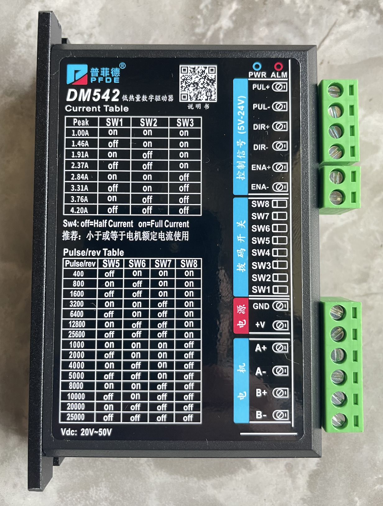
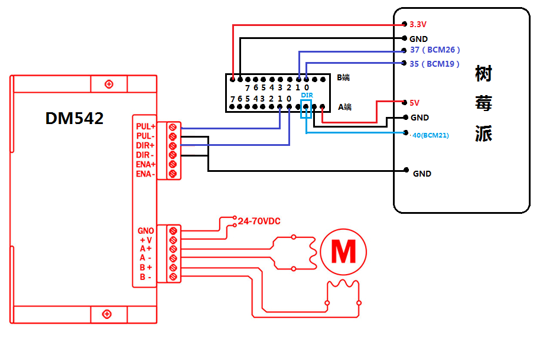
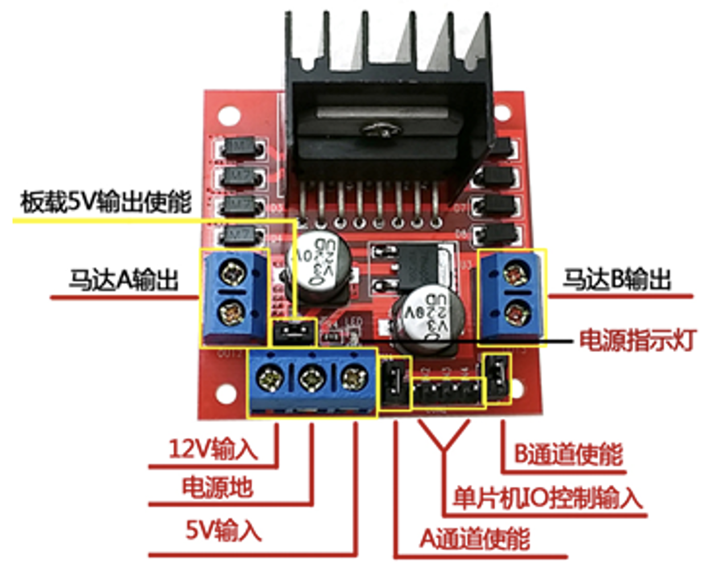
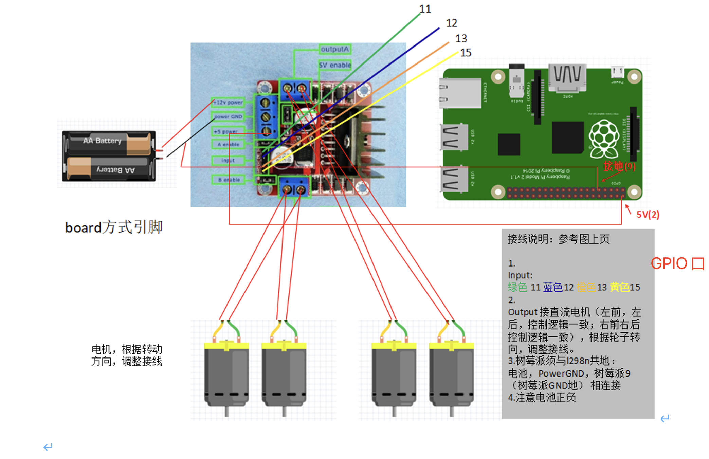
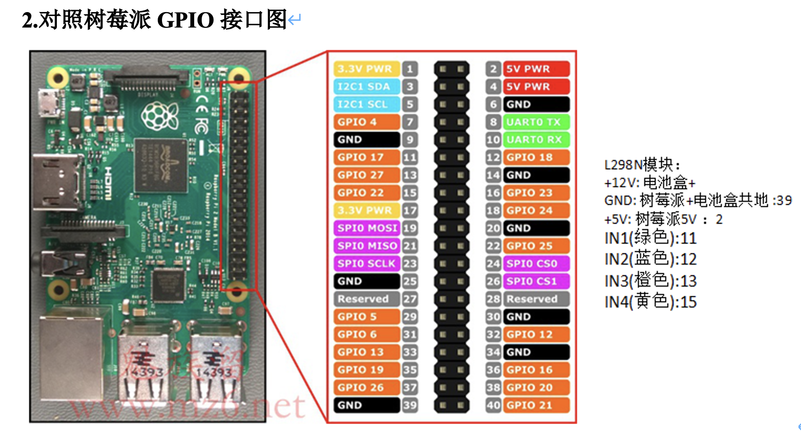
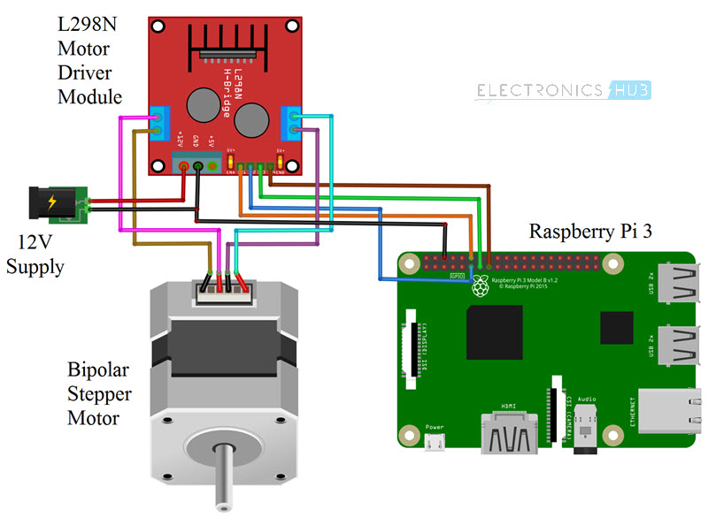

# 树莓派驱动步进电机

## 步进电机丝杆 

<br>
<div align=center>
    
</div>


### 步进电机控制器  

[淘宝商品及接线视频](https://item.taobao.com/item.htm?spm=a1z09.2.0.0.4cac2e8dXsdfZY&id=533222502094&_u=nv6cksvcdc3)  

DM542是本公司专门针对用户用量较大，同时要求性价比较高的客户应用，对于电机存在有震动，要求噪音又小的用户的首选  
- 1供电电压可达48VDC
- 2输出电流峰值可达4.2A
- 3光隔离，输入可以共阴，共阳，差分信号，脉冲最高响应频率200KHz  
- 4低速零震动，且噪音及小
- 5抗干扰能力强，在电网恶劣的环境里，可以实现高精度定位

应用领域；自动包装机，点胶机，雕刻机等自动化设备，对于以前用到有震动和噪音较大的用户有明显改善  


<br>
<div align=center>
    
</div>

控制器界面可以看到，开关(SW)1、2、3可以控制电流大小，5,6,7,8 控制脉冲宽度，范围从400~25000  

|   |  说明  |  
| -- | -- |  
| 输入电源	 | 24～50V直流电源供电，容量：不小于200VA。典型值：DC36V| 
| 输出电流	 | 1.0A～4.2A，8档可调，分辨率0.5A。| 
| 驱动方式	 | 双极恒流PWM驱动输出。| 
| 绝缘电阻	 | 常温常压下＞500MΩ。| 
| 绝缘强度	 | 常温常压下500V/分钟。| 
| 重   量   | 约200克。 | 

## TTL 电平转换  
晶体管－晶体管逻辑 Transistor-Transistor Logic，缩写为TTL，是市面上较为常见且应用广泛的一种逻辑门数字集成电路，由电阻器和晶体管而组成。TTL最早是由德州仪器所开发出来的，现虽有多家厂商制作，但编号命名还是以德州仪器所公布的资料为主。其中最常见的为74系列。  

与TTL分庭抗礼的是CMOS，旧时两者相比较TTL主要是速度快，CMOS则是速度慢，但省电、成本比TTL低。随着CMOS技术的进步，其反应速度已经超越TTL。而且CMOS内部不具有制作麻烦的电阻，所以TTL可说几乎没有发展。目前TTL主要应用于教育或是较简单的数字电路。  

TTL最主要是由N组电阻、晶体管、二极管构成的偏置电路所组合出来，在线性放大器的角度来看就是数个CE（共发射极）电路或是CC（共集电极）电路所组成。当然这只是比喻并非实际，毕竟在数字逻辑的世界就是只有0跟1，也就是关或开。

本模块可以应用于不同电平的单片机或者模块之间的通信控制，在使用过程中我们只需要提供对应的基准电源后，该模
块将相当于一根2端不同电平的导线，在双工通信中需要对方向端口进行选择配置，单向通信默认由A区到B区的控制
方向，默认不需要进行控制和连接。在单片机直接的控制连接应用相当广泛，具备宽电压转换范围。  


#### 驱动器功能说明
- #### 信号接口
PUL＋和 PUL－为控制脉冲信号正端和负端；DIR＋和DIR－为方向信号正端和负端；ENA＋和 ENA－为使能信号的正端和负端。24V需串2K电阻

- #### 电机接口  
A＋和 A－接步进电机A相绕组的正负端；B＋和B－接步进电机B相绕组的正负端。当A、B两相绕组调换时，可使电机方向反向。  

- #### 电源接口
采用直流电源供电，工作电压范围建议为20－50VDC，电源功率大于100W，根据实际使用情况开看，输入在不超过DC40V为合适选择    

- #### 指示灯  
驱动器有红绿两个指示灯。其中绿灯为电源指示灯，当驱动器上电后绿灯常亮；红灯为故障指示灯，当出现过压、过流故障时，故障灯常亮。故障清除后，红灯灭。当驱动器出现故障时，只有重新上电和重新使能才能清除故障。  

安装说明驱动器的外形尺寸为：118×75.5×34mm，安装孔距为112mmmm。既可以卧式和立式安装，建议采用立式安装。安装时，应使其紧贴在金属机柜上以利于散热。

## 接线  

### 步进电机接线 
42步进电机接线图  黑线A+, 绿线A-，，红线B+，蓝线B-  

### DM542 与 树莓派接线 


<br>
<div align=center>
    
</div>  


## 控制代码 

[wiringPi配置](#wiringPi)  

```c
// stepmotor.cpp
#include <stdio.h>
#include <wiringPi.h>

// BCM编码
const int pinPUL = 26;  // 驱动器PUL+
const int pinDIR = 19;  // 驱动器DIR+
const int pinTRAN = 21; // 电平转换模块DIR (TRAN是Transform缩写)

// 初始化
int setup() {
    // BCM编码
    // 如果使用其他编码方式，上面的pinPUL和pinDIR也需要相应修改
    if (wiringPiSetupGpio() != 0) {
        printf("Wiringpi setup failed\n");
        return 0;
    }

    pinMode(pinPUL, OUTPUT);
    pinMode(pinDIR, OUTPUT);
    pinMode(pinTRAN, OUTPUT);
    
    // 电平转换模块DIR端口置低电平，转换方向为 B==>A
    digitalWrite(pinTRAN, LOW);
    
    return 1;
}

// 顺时针转动(这里是假设，需要自行验证)
void CW() {
    digitalWrite(pinDIR, LOW);
}

// 逆时针转动
void CCW() {
    digitalWrite(pinDIR, HIGH);
}

// 发射一次脉冲
// @param: delayMicroS (微秒)
//    可以控制脉冲频率，进而控制电机转速
//    参数值越大，每两次脉冲之间的延时越长，脉冲频率越低，转速越慢
//    参数值越小，转速越快
// 但是！尽量不要小于60
void pulseOnce(int delayMicroS) {
    digitalWrite(pinPUL, HIGH);
    delayMicroseconds(delayMicroS);
    digitalWrite(pinPUL, LOW);
    delayMicroseconds(delayMicroS);
}

// 发射count次脉冲
void pulse(int count, int delayMicroS) {
    for (int i = 0; i < count; ++i) {
        pulseOnce(delayMicroS);
    }
}


int main() {
    if (!setup()) {
        return 1;
    }

    // 设置为顺时针转动
    CW();

    // 转5圈
    pulse(1600 * 5, 200);
}
```

### [L298N](https://www.sparkfun.com/datasheets/Robotics/L298_H_Bridge.pdf)     

L298N是意法半导体集团旗下量产的一种电机驱动芯片，拥有工作电压高、输出电流大、驱动能力强、发热量低、抗干扰能力强等特点，通常用来驱动继电器、螺线管、电磁阀、直流电机以及步进电机。  

L298是L293电机驱动芯片的高功率、大电流版本， 由Multiwatt 15封装，N是L298的封装标识符，另外还有其他两种不同类型的封装方式：

- P 立式封装
- HN 侧安封装
 

L298N接口功能图解如下：

<br>
<div align=center>
    
</div>  


<br>
<div align=center>
    
</div>  


<br>
<div align=center>
    
</div>  


通过L298N控制步进电机: 

<br>
<div align=center>
    
</div>  


## [wiringPi](https://github.com/WiringPi/WiringPi)   
[github源码](https://github.com/WiringPi/WiringPi)  

wiringPi updated to 2.52 for the Raspberry Pi 4B
Posted on June 24, 2019 by Gordon
Just a quick post to let you know that you’ll need a new wiringPi for the Raspberry Pi 4B.

To upgrade:
```
cd /tmp
wget https://project-downloads.drogon.net/wiringpi-latest.deb
sudo dpkg -i wiringpi-latest.deb
```

Check with:
```
gpio -v
```

and make sure it’s version 2.52. I’ll push the updated sources shortly.

It will hopefully be part of the official release soon, but for now this will do.

vscode 调试配置  `-lwiringPi`  

```json
{
    // See https://go.microsoft.com/fwlink/?LinkId=733558
    // for the documentation about the tasks.json format
    "version": "2.0.0",
    "tasks": [
        {
            "type": "cppbuild",
            "label": "c_build",
            "command": "/usr/bin/gcc",
            "args": [
                "-fdiagnostics-color=always",
                "-g",
                "${file}",
                "-o",
                "${fileDirname}/${fileBasenameNoExtension}",
                "-lwiringPi"
            ],
            "options": {
                "cwd": "${fileDirname}"
            },
            "problemMatcher": [
                "$gcc"
            ],
            "group": {
                "kind": "build",
                "isDefault": true
            },
            "detail": "c编译任务"
        }
    ]
}
```

launch.json 

```json
{
    // 使用 IntelliSense 了解相关属性。 
    // 悬停以查看现有属性的描述。
    // 欲了解更多信息，请访问: https://go.microsoft.com/fwlink/?linkid=830387
    "version": "0.2.0",
    "configurations": [
        {
            "name": "(gdb) 启动",
            "type": "cppdbg",
            "request": "launch",
            "program": "${workspaceFolder}/${fileBasenameNoExtension}",
            "args": [],
            "stopAtEntry": false,
            "cwd": "${fileDirname}",
            "environment": [],
            "externalConsole": false,
            "MIMode": "gdb",
            "setupCommands": [
                {
                    "description": "为 gdb 启用整齐打印",
                    "text": "-enable-pretty-printing",
                    "ignoreFailures": true
                },
                {
                    "description":  "将反汇编风格设置为 Intel",
                    "text": "-gdb-set disassembly-flavor intel",
                    "ignoreFailures": true
                }
            ],
            "preLaunchTask": "c_build"
        }

    ]
}
```

源码路径添加`/root/work/WiringPi-master/**`: 
.vscode/c_cpp_properties.json  
```json
{
    "configurations": [
        {
            "name": "Linux",
            "includePath": [
                "${workspaceFolder}/**",
                "/root/work/WiringPi-master/**"
            ],
            "defines": [],
            "compilerPath": "/usr/bin/gcc",
            "cStandard": "gnu17",
            "cppStandard": "gnu++14",
            "intelliSenseMode": "linux-gcc-arm"
        }
    ],
    "version": 4
}
```