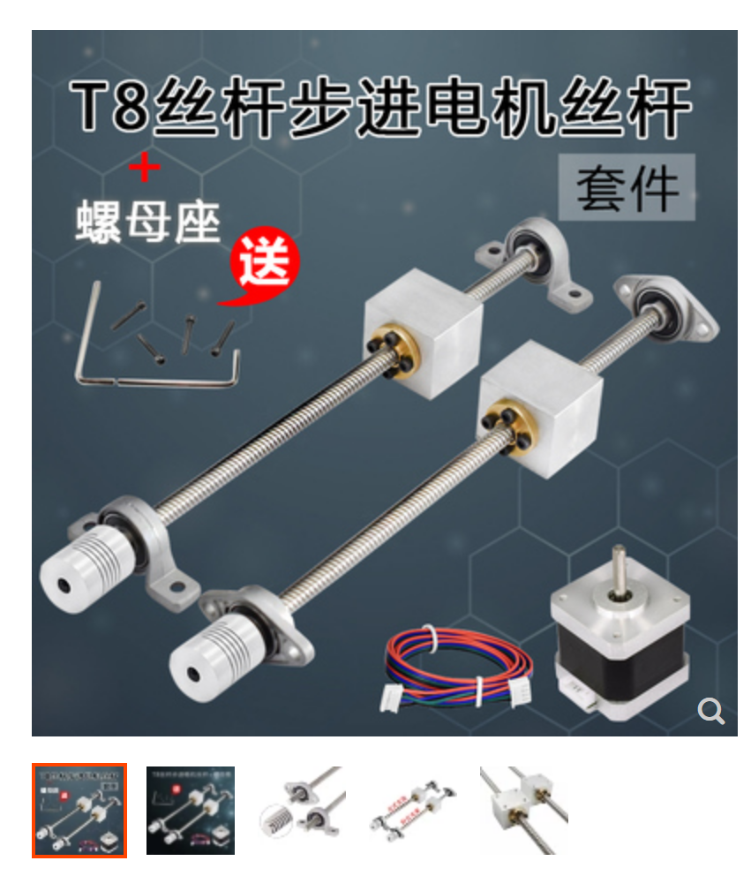

# 树莓派驱动步进电机

## 步进电机丝杆 

 

    

### 步进电机控制器  

[淘宝商品及接线视频](https://item.taobao.com/item.htm?spm=a1z09.2.0.0.4cac2e8dXsdfZY&id=533222502094&_u=nv6cksvcdc3)  

DM542是本公司专门针对用户用量较大，同时要求性价比较高的客户应用，对于电机存在有震动，要求噪音又小的用户的首选  
- 1供电电压可达48VDC
- 2输出电流峰值可达4.2A
- 3光隔离，输入可以共阴，共阳，差分信号，脉冲最高响应频率200KHz  
- 4低速零震动，且噪音及小
- 5抗干扰能力强，在电网恶劣的环境里，可以实现高精度定位

应用领域；自动包装机，点胶机，雕刻机等自动化设备，对于以前用到有震动和噪音较大的用户有明显改善  

 

    

控制器界面可以看到，开关(SW)1、2、3可以控制电流大小，5,6,7,8 控制脉冲宽度，范围从400~25000  

|   |  说明  |  
| -- | -- |  
| 输入电源	 | 24～50V直流电源供电，容量：不小于200VA。典型值：DC36V| 
| 输出电流	 | 1.0A～4.2A，8档可调，分辨率0.5A。| 
| 驱动方式	 | 双极恒流PWM驱动输出。| 
| 绝缘电阻	 | 常温常压下＞500MΩ。| 
| 绝缘强度	 | 常温常压下500V/分钟。| 
| 重   量   | 约200克。 | 

#### 驱动器功能说明
- #### 信号接口
PUL＋和 PUL－为控制脉冲信号正端和负端；DIR＋和DIR－为方向信号正端和负端；ENA＋和 ENA－为使能信号的正端和负端。24V需串2K电阻

- #### 电机接口  
A＋和 A－接步进电机A相绕组的正负端；B＋和B－接步进电机B相绕组的正负端。当A、B两相绕组调换时，可使电机方向反向。  

- #### 电源接口
采用直流电源供电，工作电压范围建议为20－50VDC，电源功率大于100W，根据实际使用情况开看，输入在不超过DC40V为合适选择    

- #### 指示灯  
驱动器有红绿两个指示灯。其中绿灯为电源指示灯，当驱动器上电后绿灯常亮；红灯为故障指示灯，当出现过压、过流故障时，故障灯常亮。故障清除后，红灯灭。当驱动器出现故障时，只有重新上电和重新使能才能清除故障。  

安装说明驱动器的外形尺寸为：118×75.5×34mm，安装孔距为112mmmm。既可以卧式和立式安装，建议采用立式安装。安装时，应使其紧贴在金属机柜上以利于散热。

## 接线  

### 步进电机接线 
42步进电机接线图  黑线A+, 绿线A-，，红线B+，蓝线B-  

### DM542 与 树莓派接线 

### [L298N](https://www.sparkfun.com/datasheets/Robotics/L298_H_Bridge.pdf)     

L298N是意法半导体集团旗下量产的一种电机驱动芯片，拥有工作电压高、输出电流大、驱动能力强、发热量低、抗干扰能力强等特点，通常用来驱动继电器、螺线管、电磁阀、直流电机以及步进电机。  

L298是L293电机驱动芯片的高功率、大电流版本， 由Multiwatt 15封装，N是L298的封装标识符，另外还有其他两种不同类型的封装方式：

- P 立式封装
- HN 侧安封装
 

L298N接口功能图解如下：

 

    

  

 

    

  

 

    

  

通过L298N控制步进电机: 

 

    

  