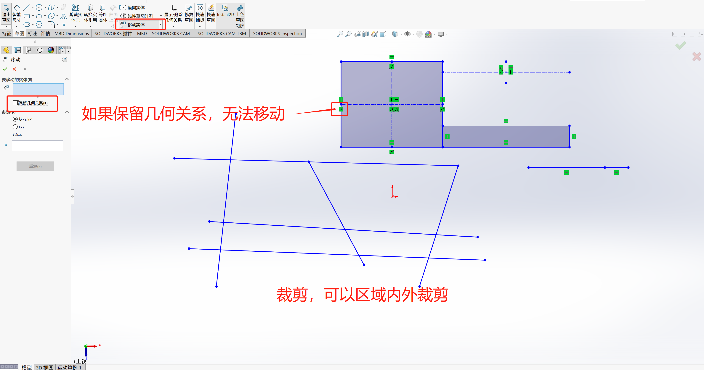

- [草图基础](#草图基础)
  - [草图的绘制](#草图的绘制)
  - [草图的编辑](#草图的编辑)
  - [草图的约束](#草图的约束)
    - [几何约束](#几何约束)
    - [尺寸约束](#尺寸约束)
    - [全约束](#全约束)
  - [草图绘制的一般过程](#草图绘制的一般过程)
  - [草图知识点](#草图知识点)

# 草图基础  
## 草图的绘制  

- 绘制直线；绘制中心线；绘制中点线  
- 绘制矩形  
- 绘制圆与圆弧  
- 直线与圆孤的快速切换  
- 绘制多边形  
- 绘制槽囗  
- 绘制椭圆  
- 绘制样条线  
- 绘制文本  
- 绘制点  

 

    

     绘制直线；绘制中心线；绘制中点线 

 

> 如果是两点一线，直接单击后拖住鼠标，然后释放即可。如果是多线线段，通过单机控制，双击结束绘制。  

 

    

    绘制矩形 

 

 

    

    绘制圆与圆弧 

 

 

    

    多边形与槽口 

 

 

    

    绘制样条曲线及文字 

 

## 草图的编辑 
对于简单草图，在绘制的时候对个别图元可以确定好，但是不是每一个图元都可以一
步到位的绘制好，在绘制完成后还要对其进行必要的修剪或复制才能完成，这就是草图的
编辑。  

我们在绘制草图的时候，绘制的速度较快，经常会出现绘制的图元形状和位置不符合
要求的情况，这个时候就需要对草图进行编辑。  

1. #### **调整类**的编辑工具（图元的操纵、修剪、延伸、移动、旋转、缩放、伸展）  
2. #### **复制类**的编辑工具（镜像（动态镜像）、等距、阵列、复制）  
3. #### **创建类**的编辑工具（园角、倒角）  
4. #### 其他编辑工具（将一般图元转换为构造图元）  

 

    

 

    

    草图编辑工具及示例 

> 比如镜像、裁剪等工具，需要选择辅助元素，可以在工具中选择额外对象。  

## 草图的约束  
- 几何约束  
- 尺寸约束
- 全约束  

### 几何约束
按照我们设计的要求及绘制截面草图的过程，我们将草图的形状绘制出来之后，我们
一般会根据实际要求增加一些如平行、相切、相等和共线等约束来帮助草图定位。我们把
这些定义图元和图元之间相对位置关系的约束叫做草图几何约束。在`Solid works`中可以很容易地添加这些约束  

> 添加几何关系，需要通过按住`Ctrl`键，选择多个元素，然后增加几何关系。  

 

    

    几何约束1 

 

    

    几何约束2 

### 尺寸约束
- 驱动尺寸：通过值来驱动对象发生相应的变化。
- 从动尺寸：根据对象确定尺寸的大小。
- 通过尺寸标注得到的尺寸是驱动尺寸。

 

    

    尺寸约束 

### 全约束  
- 草图处于完全约束，可以基于尺寸或几何约束。  

> 可以查看草图线的颜色，如果全是黑色，那就是全约束的。   
> 还可以查看状态栏中是否有`完全定义`字样，`欠定义`不是全约束。  
> 还有草图名称是否有`-`号 

## 草图绘制的一般过程  

1. #### 分析将要创建的截面几何图形
2. #### 绘制截面几何图形的大体轮廓
3. #### 初步编辑图形
4. #### 处理相关的几何约東
5. #### 标注尺寸

 

    

    约束冲突 

> 圆形半径错了，不是直径,而是半径R10

 

    

    样例1 

 

    

    样例2 

## 草图知识点  

- ### 草图中尺寸的分类  

- 智能尺寸 
- 基准尺寸 
- 链尺寸 

 

    

    样例2 

