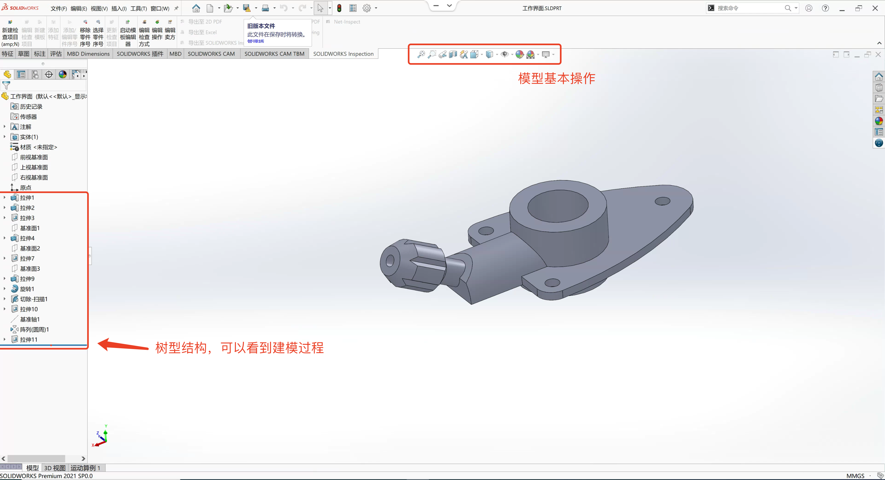
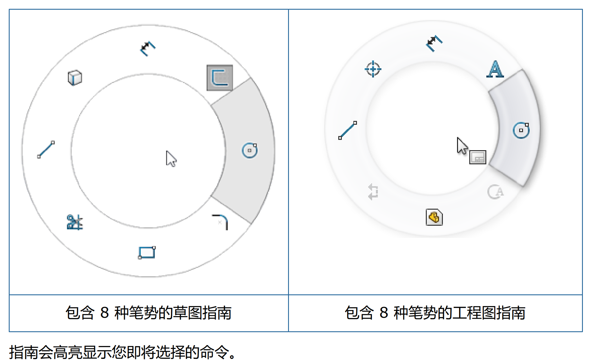

# 软件简介及Demo  

## 基础知识  

适应人群:  产品开发、机械设计、绘图员、项目工程师、造型工程师。  

SolidWorks是一套机械设计自动化软件，采用了用户熟悉的 Windows 图形界面，操作简便，易学易用，被广泛应用于机械、汽车和航空等领域 

| 入门 | 进阶 |  精通 |
| ---- | ---- | ----- | 
| 零件建模 | 曲面设计 | 运动仿真 | 
| 装配设计 | 钣金(焊接)设计 | 管道设计 |
| 工程图设计 | Top-Down | 点击布线设计 | 

Solid works提供了非常人性化并且强大的实体特征的实体建模功能，通过拉伸、旋转、扫描、放样、孔、阵列等操作来快速实现产
品的设计，用户可以非常方便的对草图或者特征进行修改 

Solid Works能够轻松完成复杂装配体的设计保让产品的正确装配。
Solid Works工程图具有快捷、符合制因规范的特点，软件提供了方便创建视国、技术标注的工具，使用户便捷地完成工程图的生成。  

- ### 软件界面  

  

- ### 鼠标操作  

- `左` 选择菜单项目、图形区域中的实体以及 FeatureManager 设计树中的对象。
- `右(R)` 显示上下文相关快捷菜单。  
- `中` 旋转、平移和缩放零件或装配体，以及在工程图中平移。
- `鼠标笔势` 可以使用鼠标笔势作为执行命令的一个快捷键，类似于键盘快捷键。 了解命令对应的方向后，您即可使用鼠标笔势快速调用对应的命令。

要激活鼠标笔势，在图形区域中，按照命令所对应的笔势方向以右键拖动。当您右键拖动鼠标时，有一个指南出现，显示每个笔势方向所对应的命令  

 

    

    鼠标笔势 

 

- ### 设计过程  
设计过程通常包含以下步骤：
- 确定模型要求
- 根据确定的需求构思模型
- 基于概念开发模型
- 分析模型
- 建立模型原型
- 构建模型
- 根据需要编辑模型

- ### 设计方法  

在开始真正地设计模型之前，对模型的生成方法进行细致地计划会很有用。  
落实需求并确定适当的概念以后，可以开发模型：  

- `草图` 生成草图并且决定如何标注尺寸以及在何处应用几何关系。  
- `特征` 选择适当的特征(如拉伸和圆角），确定要应用的最佳特征并且决定以何种顺
序应用这些特征。  
- `装配体` 选择要配合的零部件以及要应用的配合类型。  

> 几乎所有模型都包含一个或多个草图以及一个或多个特征。 但是，并非所有的模型都包含装配体。  

## 学习内容  

CAD设计包含`机械设计`、`室内设计`、`建筑设计`、`平面设计`。    

  

 

  

## Demo示例  