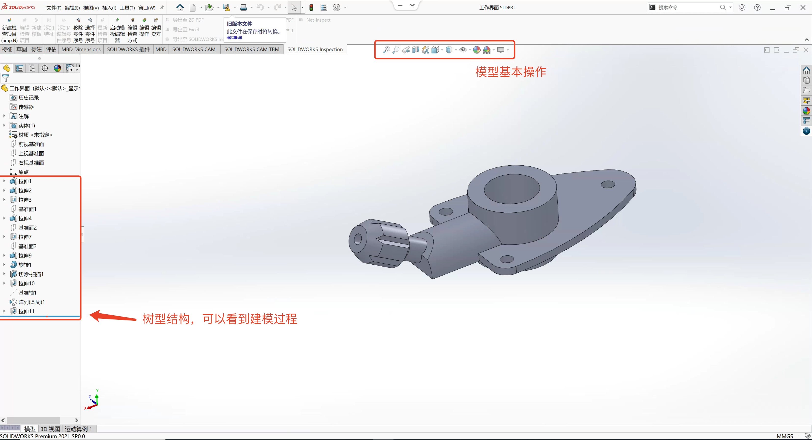

# 软件简介及示例    

## 基础知识  

适应人群:  产品开发、机械设计、绘图员、项目工程师、造型工程师。  

SolidWorks是一套机械设计自动化软件，采用了用户熟悉的 Windows 图形界面，操作简便，易学易用，被广泛应用于机械、汽车和航空等领域 

| 入门 | 进阶 |  精通 |
| ---- | ---- | ----- | 
| 零件建模 | 曲面设计 | 运动仿真 | 
| 装配设计 | 钣金(焊接)设计 | 管道设计 |
| 工程图设计 | Top-Down | 点击布线设计 | 

Solid works提供了非常人性化并且强大的实体特征的实体建模功能，通过拉伸、旋转、扫描、放样、孔、阵列等操作来快速实现产
品的设计，用户可以非常方便的对草图或者特征进行修改 

Solid Works能够轻松完成复杂装配体的设计保让产品的正确装配。
Solid Works工程图具有快捷、符合制因规范的特点，软件提供了方便创建视国、技术标注的工具，使用户便捷地完成工程图的生成。  

- ### 软件界面  

  

- ### 鼠标操作  

- `左` 选择菜单项目、图形区域中的实体以及 FeatureManager 设计树中的对象。
- `右(R)` 显示上下文相关快捷菜单。  
- `中` 旋转、平移和缩放零件或装配体，以及在工程图中平移。
- `鼠标笔势` 可以使用鼠标笔势作为执行命令的一个快捷键，类似于键盘快捷键。 了解命令对应的方向后，您即可使用鼠标笔势快速调用对应的命令。

要激活鼠标笔势，在图形区域中，按照命令所对应的笔势方向以右键拖动。当您右键拖动鼠标时，有一个指南出现，显示每个笔势方向所对应的命令  

 

    

    鼠标笔势 

 

- ### 设计过程  
设计过程通常包含以下步骤：
- 确定模型要求
- 根据确定的需求构思模型
- 基于概念开发模型
- 分析模型
- 建立模型原型
- 构建模型
- 根据需要编辑模型

- ### 设计方法  

在开始真正地设计模型之前，对模型的生成方法进行细致地计划会很有用。  
落实需求并确定适当的概念以后，可以开发模型：  

- `草图` 生成草图并且决定如何标注尺寸以及在何处应用几何关系。  
- `特征` 选择适当的特征(如拉伸和圆角），确定要应用的最佳特征并且决定以何种顺
序应用这些特征。  
- `装配体` 选择要配合的零部件以及要应用的配合类型。  

> 几乎所有模型都包含一个或多个草图以及一个或多个特征。 但是，并非所有的模型都包含装配体。  

- ### 草图  

草图是大多数 3D 模型的基础。
通常，创建模型的第一步是绘制草图，随后可以从草图生成特征。将一个或多个特征组合即生成零件。
然后，可以组合和配合适当的零件以生成装配体。从零件或装配体，您就可以生成工程图。
草图指的是**2D轮廓或横断面**。您可以使用基准面或平面来创建 2D 草图。除了 2D 草图，还可以创建
包括 X 轴、Y 轴和 Z 轴的 3D 草图。
创建草图的方法有很多种。所有草图都包含以下元素:  

  - #### 原点  

在许多情况下，您都是从原点开始绘制草图，原点为草图提供了定位点。
以下草图也包括中心线。 中心线是通过原点绘制的，用于生成旋转特征  

 

    

 

在草图中，**中心线**不是必不可少的，但它可以用来帮助建立对称关系。 您还可以使用中心线来应用镜向关系，以及在草图实体之间建立相等和对称关系。 对称特征是一种重要工具，可帮助您更加快捷地生成轴对称模型  

  - #### 基准面  

可以在零件或装配体文档中生成基准面。在基准面上，可以使用直线或矩形之类的草图绘制工具来绘制草图，还可以创建模型的剖面视图。在一些模型上，
在其中绘制草图的基准面仅影响模型在标准等轴测视图 (3D) 中的显示方式，而对于设计意图并无影响。
对于其它模型而言，选择正确的初始基准面来绘制草图，可以帮助您生成更加高效的模型。
选择要在其中绘制草图的基准面。 标准基准面为前视、上视及右视方向。 您也可以根据需要添加和定位基准面。 本范例使用上视基准面。  

> 可以使用基准面来绘制草图，生成模型的剖面视图.  

  - #### 尺寸  

可以在实体之间指定尺寸，如长度和半径。 当您更改尺寸时，零件的大小和形状也会随之更改。 您为
零件标注尺寸的方式，将决定能否保持设计意图。 
本软件使用两类尺寸：驱动尺寸和从动尺寸。

- 驱动尺寸  
您可以使用智能尺寸工具来生成驱动尺寸。 当您更改驱动尺寸的数值时，模型大小随之更改。 例如，
在水龙头把手中，可以将水龙头把手的高度从 40mm 更改为 55mm。
由于未标注样条曲线的尺寸，这将改变旋转零件的形状。 要保持由样条曲线生成的形状不变，您需要
为样条曲线标注尺寸。

 

    

 

    

 

- 从动尺寸  
某些与模型相关的尺寸为从动尺寸。 可以使用智能尺寸工具来创建从动尺寸或参考尺寸以供参考。 当
您修改模型中的驱动尺寸或几何关系时，从动尺寸的数值也随之更改。 除非将从动尺寸转换为驱动尺
寸，否则无法直接修改从动尺寸的数值。
在水龙头把手中，如果将总高度标注为 40mm、样条曲线以下竖直部分为 7mm、样条线段为 25mm，
则样条曲线以上的竖直线段计算为 8mm 并用从动尺寸表示。
您通过驱动尺寸和几何关系的放置位置来控制设计意图。例如，如果将总高度标注为 40mm，并在顶
部和底部竖直线段之间建立相等几何关系，则顶部线段变成 7mm。竖直尺寸 25mm 与其它尺寸和
几何关系发生冲突，因为 40-7-7=26，而不是 25。将尺寸 25mm 更改成从动尺寸可以消除冲突并
且显示样条曲线长度必须为 26mm  

 

    

 

  - #### 集合关系  

几何关系在草图实体之间建立几何关系，如相等和相切。例如，您选择两条线。 您可以在线中添加垂直和平行关系并使其相等，而无需在 PropertyManager 中作出更改或显示工具栏。

 

    

 

以下表格说明您可为几何关系选择的实体以及所产生的几何关系的特点。  

| 几何关系 | 要选择的实体 | 所产生的几何关系 | 
| ------------ | ---------- | ------------ |
| 水平或竖直 | 一条或多条直线，或两个或多个点 | 直线会变成水平或竖直（由当前草图的空间定义），而点会水平或竖直对齐  | 
| 共线 | 两条或多条直线  | 项目位于同一条无限长的直线上  | 
| 全等 | 两个或多个圆弧  | 圆弧共用同一圆心，并具有相同半径  | 
| 垂直 | 两条直线  | 两条直线相互垂直  | 
| 平行 | 两条或多条直线 | 3D 草图中一条直线和一基准面（或平面） | 
| 与 YZ 平行 | 3D 草图中一条直线和一基准面（或平面）  | 直线相对于所选基准面与 YZ 基准面平行  | 
| 与 ZX 平行 | 3D 草图中一条直线和一基准面（或平面）  | 直线相对于所选基准面与 ZX 基准面平行  | 
| 沿 Z | 3D 草图中一条直线和一基准面（或平面）  | 直线与所选基准面的面正交  |
| 相切 | 一圆弧、椭圆、或样条曲线，以及一直线或圆弧  | 两个项目保持相切 | 
| 同心 | 两个或多个圆弧，或一个点和一个圆弧  | 圆弧共用同一圆心 | 
| 中点 | 两条直线或一个点和一直线  | 点保持位于线段的中点 | 
| 交点 | 两条直线和一个点  | 点保持于直线的交叉点处  | 

- ### 特征  

完成草图以后，您可以使用拉伸（水龙头基座）或旋转（水龙头把手）等特征来生成 3D 模型。  

1. 生成草图。 
2. 给草图标注尺寸。  
 

    

 

3. 将草图拉伸 10mm  

    

 

有些基于草图的特征为各种形状，如凸台、切除、孔等。 另外一些基于草图的特征（例如放样和扫描）则使用沿路径的轮廓。
另一类特征称为应用特征，它不需要草图。应用特征包括圆角、倒角或抽壳等。之所以称们为“应用特征”是因为要使用尺寸和其它特性将它们应用于现有几何体才能生成该特征。
通常，您通过包含基于草图的特征（如凸台和孔）生成零件。 然后您添加应用特征。  

[特征使用的具体手段](http://help.solidworks.com/2016/chinese-simplified/solidworks/sldworks/r_Features_Toolbar_features.htm)  

    

 

- ### 装配体  
您可以将能够装配在一起的多个零件组合起来以生成装配体。
通过使用同心和重合等配合，可以将多个零件集合为装配体。 配合定义零部件的允许的移动方向。 在水龙头装配体中，水龙头基座和把手具有同心和重合配合。

    

 

- ### 工程图  
您可以从零件或装配体模型生成工程图。
工程图提供有多个视图，例如标准三视图和等轴测视图 (3D) 等。 您可以从模型文件导入尺寸并且添
加注解（例如基准目标符号）等。

    

 

- ### 模型编辑  
使用 SOLIDWORKS FeatureManager 设计树和 PropertyManager 编辑草图、工程图、零件或装
配体。 还可以通过在图形区域中直接选择特征和草图来编辑它们。 有了这种直观的方法，您就不需要
再知道特征的名称

  - 编辑草图

可以在 FeatureManager 设计树中选择一个草图并编辑它。例如，您可以编辑草图实
体、更改尺寸、查看或删除现有几何关系、在草图实体之间添加新几何关系或者更改尺
寸显示的大小。还可以在图形区域中直接选择要编辑的特征。

  - 编辑特征  

在生成一个特征后，您可以更改其大多数数值。 使用编辑特征显示适当的
PropertyManager。 例如，如果对边线应用等半径圆角，则会显示 圆角编辑特征
PropertyManager，您可以在其中更改半径。 还可以通过双击图形区域中的特征或草
图使尺寸显示出来，然后就地更改尺寸的方式来编辑尺寸。

  - 隐藏和显示  

对于某些几何体，例如单个模型中的多个曲面实体，您可以隐藏或显示其中一个或多个
曲面实体。您也可以在所有文件中隐藏和显示草图、基准面和轴，在工程图中隐藏和显
示视图、线条和零部件。

  - 压缩和解除压缩

您可以从 FeatureManager 设计树中选择任何特征，并压缩此特征以查看不包含此特征
的模型。 压缩某一特征时，该特征暂时从模型中移除，但没有删除。 该特征从模型视图
压缩和解除压缩中消失。 然后可以将此特征解除压缩，以初始状态显示模型。 并且，您也可以压缩和解
除压缩装配体中的零部件

  - 退回  

在处理具有多个特征的模型时，您可以将 FeatureManager 设计树退回到先前的某个状
态。移动退回控制条将显示至退回状态为止模型中存在的所有特征，直到您将
退回FeatureManager 设计树返回初始状态。退回功能可用于插入其它特征之前的一些特
征、在编辑模型的同时缩短重建模型的时间或者学习以前如何生成模型。

    

 

- ### 零件实例  

  

## 学习内容  

CAD设计包含`机械设计`、`室内设计`、`建筑设计`、`平面设计`。    

  

 

  
