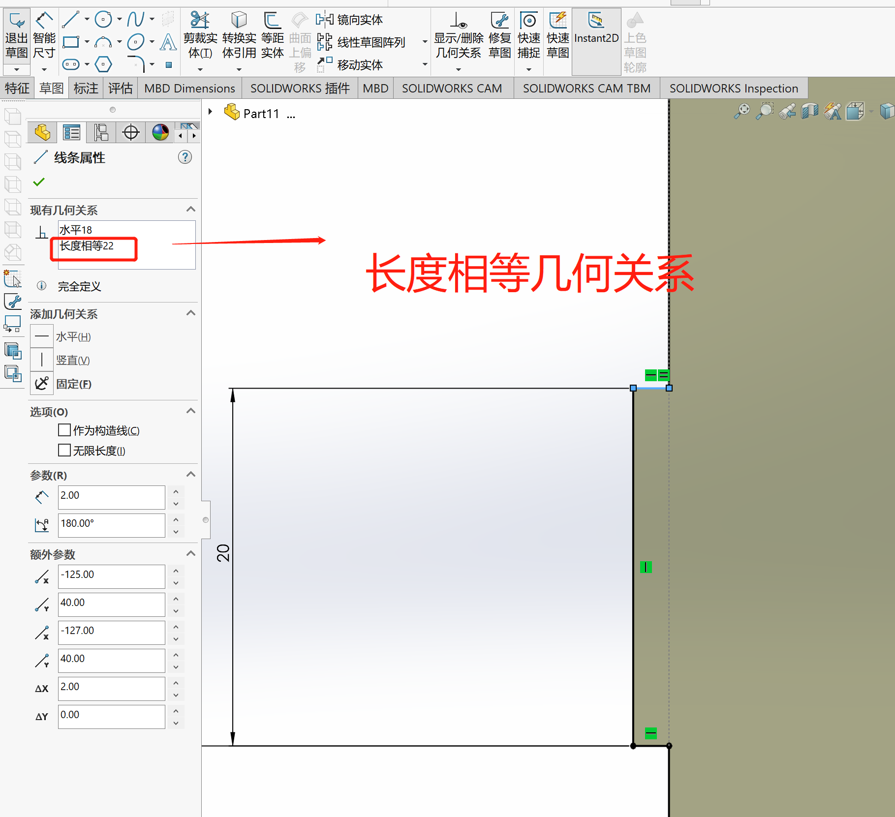
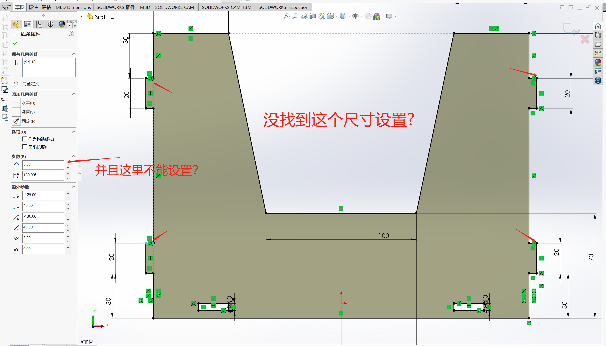
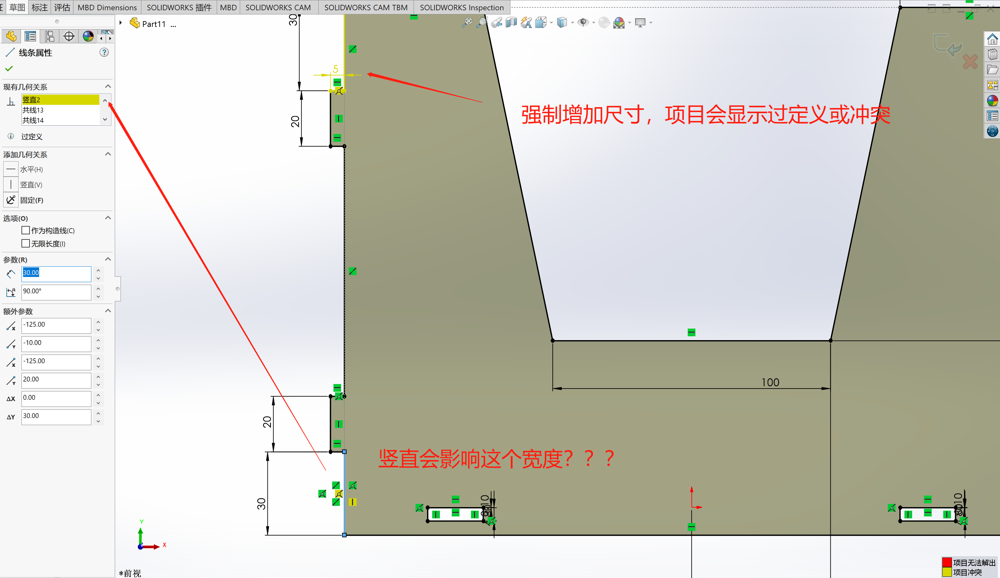
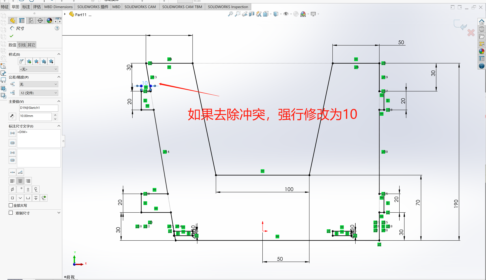
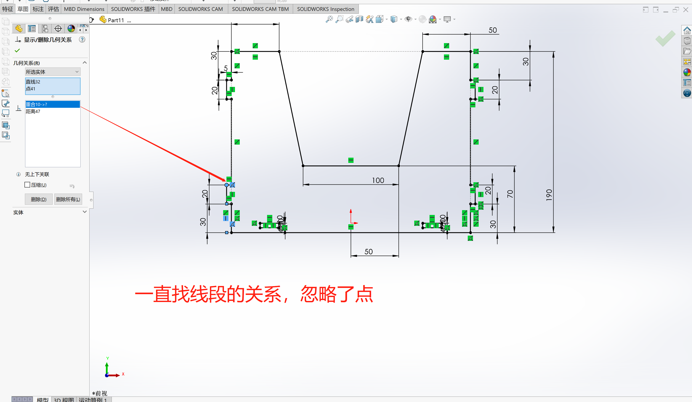
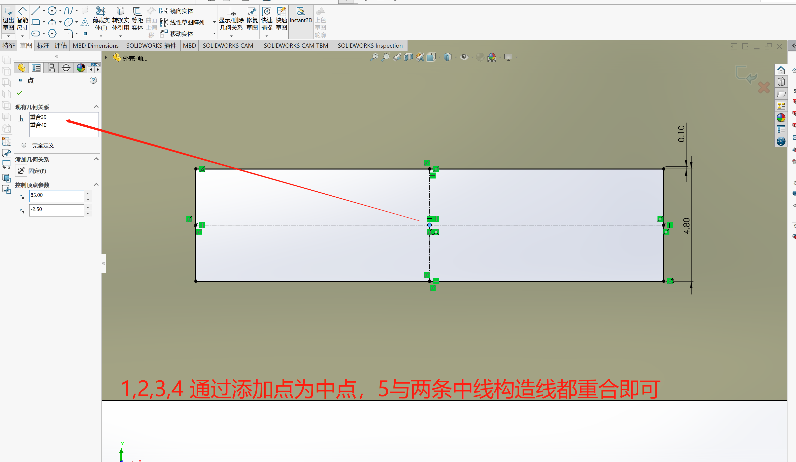

# 实践与问题 

## 配置相关 
- ### 一个零件多个配置参数  
设计一个羽毛球机，不同钢板的厚度，很多草图参数也要修改，如何通过配置实现多个参数切换呢？这样工程图也跟着切换，可直接用于生产！！  

## 草图相关 
- ### 草图中很多尺寸想使用同一个，链接的尺寸变化，所有的尺寸都跟着变化？ 

**几何关系相等** 

<br>
<div align=center>
    
</div>

- ### 草图尺寸无法修改，如何查看被啥约束了？ 
<br>
<div align=center>
    
</div>

> 增加智能尺寸后，所选尺寸为从动尺寸，其值无法修改？  
> 那就故意制造冲突，查看约束点   

<br>
<div align=center>
    
</div>

> 竖直为什么会影响这个呀？  

<br>
<div align=center>
    
</div>

这个竖直为什么会影响呢？因为这个边角有个点是重合关系，`重合关系10`->?是点直线32和点41 

<br>
<div align=center>
    
</div>

一直没有找到`直线32`?  也无法搜索线段，那就直接删除`重合关系10`，直接设置尺寸。  


- ### 如何找出矩形的中心点？  

选择直线->构造线，连接对角，添加点与之重合即可。   

<br>
<div align=center>
    
</div>

> 可以参照系统创建矩形的初始状态  

## 零件相关 

## 装配体相关 

## 工程图相关 
- ### 工程图导出CAD图纸及图片  

<br>
<div align=center>
    
</div>
<br> 

> 工程图另存为就行了，工程图内多个图纸对应与dwg格式多个图层。  
> 工程图导出的dwt或者图片可以导入草图   

## 其他 
- ### 代码实现  

```javascript
public void DoSketch()
{
    SldWorks swApp = API_Learn.Learn_Sldworks.NewSolidworksApp();
    ModelDoc2 SketchDoc = swApp.NewPart();//新建零件,验证获得Solidworks程序对象成功
    try
    {
        swApp.SetUserPreferenceToggle(10, false);//不弹出尺寸标注对话框
        API_Learn.Learn_SketchManager.AddConstraintAndDim(SketchDoc);
    }
    catch
    {

    }
    finally
    {
         swApp.SetUserPreferenceToggle(10, true);//恢复弹出尺寸标注对话框
    } 
}

public static void AddConstraintAndDim(ModelDoc2 SketchDoc)
{
    SketchManager SwSketchMrg = SketchDoc.SketchManager;//获得SketchManager对象
    SketchDoc.Extension.SelectByID2("前视基准面", "PLANE", 0, 0, 0, false, 0, null, 0);
    SwSketchMrg.InsertSketch(true);//进入编辑草图模式
    object[] ObjRectangle = SwSketchMrg.CreateCenterRectangle(0, 0, 0, 0.075, 0.04, 0);
    SketchSegment SktCircle1 = SwSketchMrg.CreateCircle(-0.0425, 0, 0, -0.03, 0, 0);
    SketchSegment SktCircle2 = SwSketchMrg.CreateCircle(0.0425, 0, 0, 0.03, 0, 0);
    SketchSegment SktCentLine = SwSketchMrg.CreateCenterLine(0, 0.04, 0, 0, -0.04, 0);

    #region 两个圆心添加水平
    SketchDoc.ClearSelection2(true);
    SketchDoc.Extension.SelectByID2("", "SKETCHPOINT", -0.0425, 0, 0, true, 0, null, 0);
    SketchDoc.Extension.SelectByID2("", "SKETCHPOINT", 0.0425, 0, 0, true, 0, null, 0);
    SketchDoc.SketchAddConstraints("sgHORIZONTALPOINTS2D");
    #endregion

    #region 两个圆心添加对称
    SketchDoc.ClearSelection2(true);
    SketchDoc.Extension.SelectByID2("", "SKETCHPOINT", -0.0425, 0, 0, true, 0, null, 0);
    SketchDoc.Extension.SelectByID2("", "SKETCHPOINT", 0.0425, 0, 0, true, 0, null, 0);
    SktCentLine.Select(true);
    SketchDoc.SketchAddConstraints("sgSYMMETRIC");
    #endregion

    #region 圆心与坐标原点水平
    SketchDoc.ClearSelection2(true);
    SketchDoc.Extension.SelectByID2("", "SKETCHPOINT", -0.0425, 0, 0, true, 0, null, 0);
    SketchDoc.Extension.SelectByID2("", "SKETCHPOINT", 0, 0, 0, true, 0, null, 0);
    SketchDoc.SketchAddConstraints("sgHORIZONTALPOINTS2D");
    #endregion

    #region 添加孔间距尺寸
    SketchDoc.ClearSelection2(true);
    SketchDoc.Extension.SelectByID2("", "SKETCHPOINT", -0.0425, 0, 0, true, 0, null, 0);
    SketchDoc.Extension.SelectByID2("", "SKETCHPOINT", 0.0425, 0, 0, true, 0, null, 0);
    SketchDoc.AddDimension2(0, 0.05, 0);
    #endregion

    #region 两个圆添加相同大小
    SktCircle1.Select(false);
    SktCircle2.Select(true);
    SketchDoc.SketchAddConstraints("sgSAMELENGTH");
    #endregion

    #region 添加圆尺寸
    SktCircle1.Select(false);
    SketchDoc.AddDimension2(-0.02, 0.02, 0);
    #endregion

    #region 添加矩形长
    SketchDoc.Extension.SelectByID2("", "SKETCHSEGMENT", -0.02, 0.04, 0, false, 0, null, 0);
    SketchDoc.AddDimension2(0, 0.07, 0);
    #endregion

    #region 添加矩形高
    SketchDoc.Extension.SelectByID2("", "SKETCHSEGMENT", 0.075,0 , 0, false, 0, null, 0);
    SketchDoc.AddDimension2(0.09, 0, 0);
    #endregion

    SwSketchMrg.InsertSketch(true);//退出编辑草图模式
}
```
