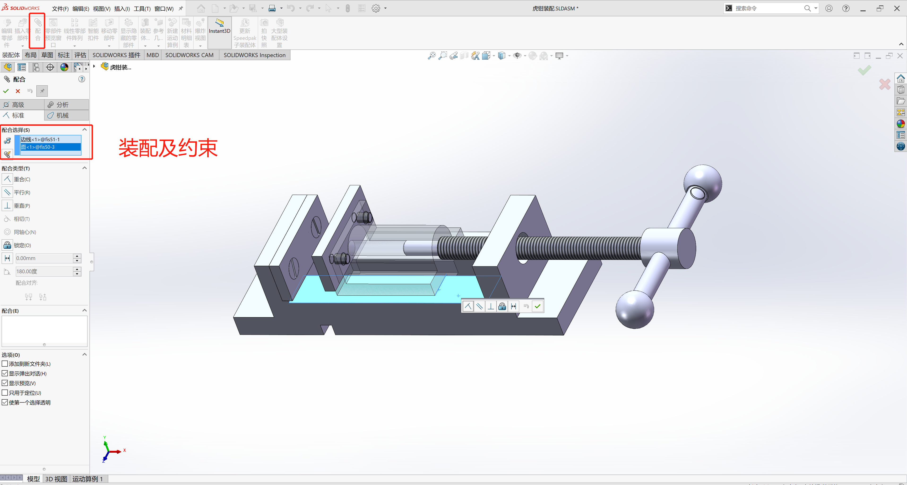

# 装配体基础 

## 装配的一般过程  

模拟真实产品的装配，优化装配工艺得到产品的完整的数字模型，易于观察检查各零件之间的干涉情况
制作爆炸图辅助实际产品的装配用于制作装配体工程图  

一个产品往往由多个零件组合(装配)而形成，零件的组合是在装配模块中完成的。通过这部分的学习，
可以熟练掌握产品装配的一般过程，掌握一些基本的装配技能。 

1. 新建装配文件
2. 装配第一个零件、引入零件、**装配约束**零件
3. 装配其他零件。
4. 保存

> 装配第一个件时需要直接确定，固定基准面。  

solidworks 文件格式有
```
.AI	    Adobe Illustrator文件	
.ASM	装配件
.DRW    Sloidworks 工程图
.DWG	AutoCAD图形数据库文件	
.DXF	工程图交换格式文件	
.IGES	IGES工程图文件	
.IGS	IGES工程图文件	
.OBJ	3D模型文件	
.PRT	CAD 3D零件或组件	
.PSD	Photoshop专用位图格式	
.SAT	ACIS SAT 3D模型文件	
.STEP	STEP 3D模型	
.STL	立体光刻CAD文件	
.STP	CAD 3D图形文件	
```

<br>
<div align=center>
    
</div>
<div align="center">
    <font face="黑体" color=gray size=3>装配的一般过程</font> 
</div>

> 装配体和装配件放在一起(同一个工作目录)，不然后期打开加载时有问题。  

## 工程图概述  
工程图是指以投影原理为基础，用多个视图清晰详尽地表达出设计产品的几何形状、结构
以及加工参数的图纸。工程图严格遵守国标的要求，它实现了设计者与制造者之问的有效
沟通，使设计者的设计意图能够简单明了地展现在图样上。从某种意义上说，工程国是一
门设计者与制造者沟通交流的语言，它在现代制造业中占据着极其重要的位置。 

重要性：
立体模型无法标注完整的加工参数，如尺寸、几何公差、加工精度、基准、表面粗糙度符号和焊接符号等。
不是所有零件都需要采用CNC或NC等数控机床加工，因而需要出示工程图在普通机床上进行传统加工。立体模型存在无法表达清楚的局部结构，通常把零件交给第三方厂家加工生产时，需要出示工程图。


## 基本视图创建  

1. 可以先打开零件，然后在菜单中选择`文件`>>从零件制作工程图, 选择`图纸格式`>>右击选择`图纸属性`, 选择图纸大小。    
2. 直接常见工程图工程，选择图纸样式及大小  

> 可以把所有零件制作在一张工程图内，直接给商家进行切割。  

通过`工程图`>>`模型视图`选择零件或者装配体，选择之后可以预览到图形，也可以选择那个视图、比例、显示样式等。  

> 可以在已打开的工程中直接选择，然后回到工程图就会自动加载选择的零件。  

- #### 主视图
- #### 投影视图
- #### 标准三视图
- #### 等轴测视图
- #### 常用的视图编辑工具


## 高级视图创建  
- #### 全剖视图
- #### 半剖视图
- #### 阶梯剖视图
- #### 旋转剖视图
- #### 局部剖视图
- #### 局部放大图
- #### 断裂视图
- #### 裁剪视图
- #### 辅助视图
- #### 针对装配体的高级视图
- #### 爆炸视图
- #### 断面图
- #### 加强筋的剖切


## 标注  

> 工程图模式下选择`注解`>>`智能尺寸`  

- #### 尺寸标注
- #### 尺寸公差标注
- #### 孔标注
- #### 注释文本标注
- #### 基准标注
- #### 形位公差标注
- #### 粗糙度符号
- #### 中心线与中心符号线